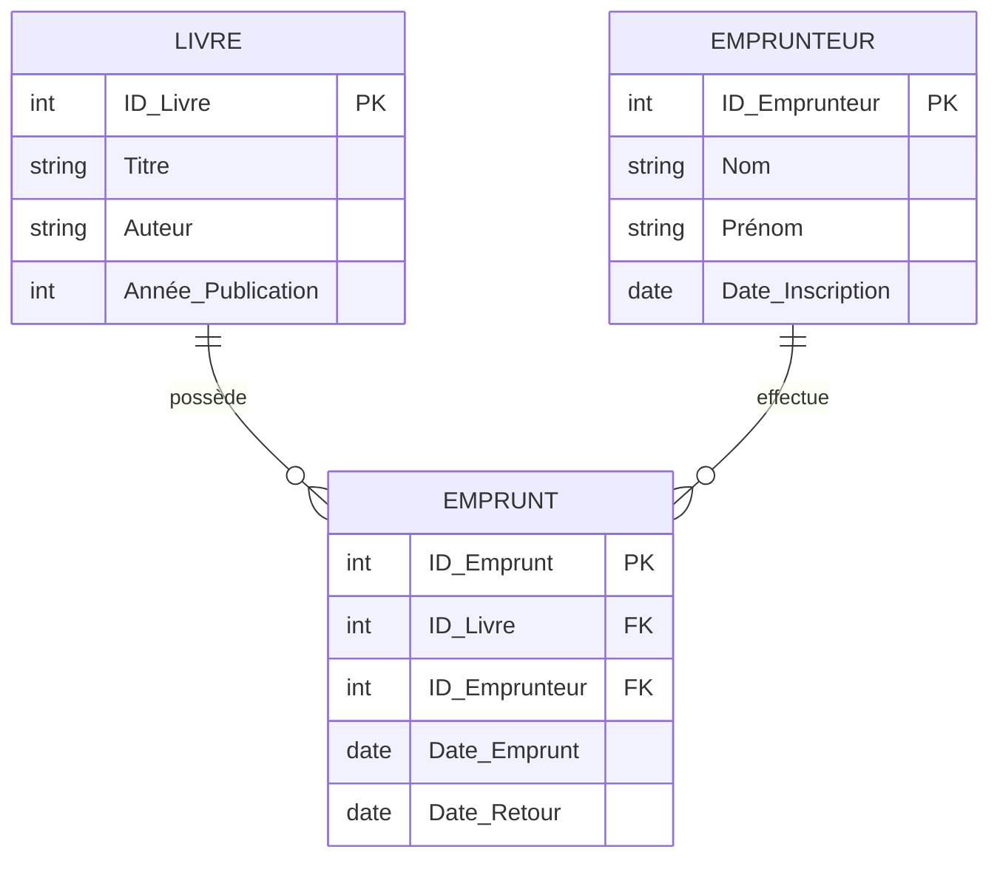

# 1-Introduction aux bases de données relationnelles  
## 1-Concepts fondamentaux des bases relationnelles  
### 1-Définition d'une base de données relationnelle

---

Une **base de données relationnelle** est un système de gestion d'information structuré en *tables* organisées en *lignes* (enregistrements) et *colonnes* (attributs) selon un modèle relationnel. Cette structure permet de représenter les données de façon claire, cohérente et facilement interrogeable.

### Qu'est-ce qu'une base de données relationnelle ?

Selon IBM et plusieurs sources spécialisées, une base de données relationnelle (RDB) :

- Stocke les informations sous forme de tables bidimensionnelles (tableaux) où chaque ligne représente un enregistrement unique et chaque colonne une caractéristique descriptive de cet enregistrement.
- Permet d'établir des liens appelés *relations* entre différentes tables en utilisant des clés primaires et étrangères.
- Utilise un langage standardisé, le **SQL** (Structured Query Language), pour manipuler et interroger les données.

Cette organisation offre une grande flexibilité pour gérer des ensembles complexes de données tout en assurant l'intégrité, la cohérence et la conformité aux règles métier.

### Exemple simple

Supposons une base de données pour gérer une bibliothèque. On pourrait avoir deux tables principales :

- **Livre** (avec colonnes : ID_Livre, Titre, Auteur, Année_Publication)
- **Emprunteur** (avec colonnes : ID_Emprunteur, Nom, Prénom, Date_Inscription)
- **Emprunt** (avec colonnes : ID_Emprunt, ID_Livre (clé étrangère), ID_Emprunteur (clé étrangère), Date_Emprunt, Date_Retour)

La table *Emprunt* crée une relation entre *Livre* et *Emprunteur*.

### Avantages des bases de données relationnelles

- **Structuration claire** : les données sont organisées en tables propres et normalisées.
- **Intégrité des données** grâce aux contraintes (clés primaires, clés étrangères, règles d’unicité).
- **Interrogation puissante** via SQL pour extraire, insérer, modifier ou supprimer des données.
- **Flexibilité** dans les relations complexes entre jeux de données.
- **Maintenance et évolutivité** facilitées grâce aux standards.

---

### Sources utilisées

- Wikipédia, [Base de données relationnelle](https://fr.wikipedia.org/wiki/Base_de_donn%C3%A9es_relationnelle)
- IBM, [Qu'est-ce qu'une base de données relationnelle](https://www.ibm.com/fr-fr/think/topics/relational-databases)
- Intersystems, [Qu'est-ce qu'une base de données relationnelle et pourquoi en avez-vous besoin ?](https://www.intersystems.com/fr/ressources/quest-ce-quune-base-de-donnees-relationnelle-et-pourquoi-en-avez-vous-besoin/)
- Google Cloud, [Qu'est-ce qu'une base de données relationnelle (SGBDR) ?](https://cloud.google.com/learn/what-is-a-relational-database?hl=fr)

---

Cette introduction précise et illustrée pose les fondations nécessaires pour comprendre le fonctionnement des bases de données relationnelles et leur importance dans la gestion structurée et fiable des informations.