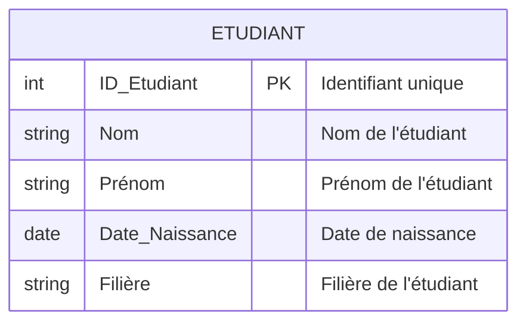

# 1-Introduction aux bases de données relationnelles  
## 1-Concepts fondamentaux des bases relationnelles  
### 2-Modèle relationnel : tables, lignes, colonnes

---

Le **modèle relationnel** est la pierre angulaire des bases de données relationnelles. C'est un modèle mathématique qui structure les données sous forme de **relations**, généralement représentées par des **tables**. 

### Structures fondamentales du modèle relationnel

#### 1. Table (Relation)

Une **table** est un ensemble d'éléments organisés de façon tabulaire, composée de lignes et de colonnes. En termes relationnels, elle est appelée *relation*. Chaque table stocke un ensemble d'entités ayant des caractéristiques communes.

#### 2. Lignes (Tuples)

Chaque **ligne** correspond à un **tuple**, c’est-à-dire un enregistrement, un objet ou un élément unique dans la table. Elle regroupe les valeurs pour chaque attribut correspondant à cet enregistrement.

#### 3. Colonnes (Attributs)

Chaque **colonne** représente une **attribut** ou un champ dimensionnel qui décrit une caractéristique ou une propriété des tuples. Chaque colonne a un nom unique dans la table et un type de données défini.

---

### Exemple concret

Considérons une table **Étudiant** dans une base de données universitaire :

| ID_Etudiant | Nom     | Prénom  | Date_Naissance | Filière     |
|-------------|---------|---------|----------------|-------------|
| 1001        | Dupont  | Alice   | 2000-05-12     | Informatique|
| 1002        | Martin  | Bob     | 1999-11-08     | Mathématiques |
| 1003        | Durand  | Claire  | 2001-03-22     | Physique    |

- **Table** : Étudiant  
- **Colonnes** : ID_Etudiant, Nom, Prénom, Date_Naissance, Filière  
- **Lignes** : Chaque étudiant (Alice, Bob, Claire) correspondant à un tuple  

Cette table illustre clairement la séparation entre structure (colonnes) et contenu (lignes).

---

### Visualisation du modèle avec un diagramme Mermaid

---

### Relations et contraintes

- **Clé primaire** : Une ou plusieurs colonnes désignent de manière unique chaque ligne, par exemple `ID_Etudiant` dans notre exemple.
- **Valeurs atomiques** : Chaque cellule (intersection ligne-colonne) doit contenir une valeur indivisible (pas de liste ou tableau).
- **Uniformité du type** : Chaque colonne contient un type unique de données (texte, date, nombre, etc.).

Ces contraintes assurent la cohérence et facilitent les opérations de requête.

---

### Synthèse

Le modèle relationnel repose sur la représentation des données sous forme de tables composées de lignes (enregistrements) et de colonnes (attributs). Cette structure simple mais puissante permet d’organiser efficacement l’information, d’assurer son intégrité et d’exploiter les relations entre données à travers des jointures.

---

### Sources utilisées

- Wikipédia, [Modèle relationnel](https://fr.wikipedia.org/wiki/Mod%C3%A8le_relationnel)
- Oracle, [Introduction to the Relational Model](https://docs.oracle.com/cd/B19306_01/server.102/b14220/models.htm)
- Microsoft Docs, [Introduction au modèle relationnel](https://docs.microsoft.com/fr-fr/sql/relational-databases/sql-server-relational-database)
- IBM, [Relational Database Concepts](https://www.ibm.com/docs/en/db2/11.1?topic=databases-relational-database-concepts)
  
---

Ce focus sur tables, lignes et colonnes propose une base claire pour comprendre la gestion, la structure et l’organisation des données dans un système relationnel.