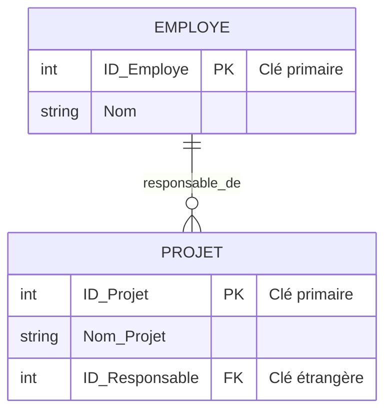

# 1-Introduction aux bases de données relationnelles  
## 1-Concepts fondamentaux des bases relationnelles  
### 3-Clés primaires et étrangères

---

Les **clés primaires** et **clés étrangères** sont des concepts essentiels du modèle relationnel permettant d’assurer l’unicité des enregistrements et de définir des relations entre les tables d’une base de données.

---

## 1. Clé primaire (Primary Key)

La **clé primaire** est un ou plusieurs attributs d’une table dont la valeur identifie de manière unique chaque ligne (tuple) de cette table.

### Caractéristiques de la clé primaire

- Elle doit être **unique** : aucune duplication de valeur n’est autorisée.
- Elle ne doit pas contenir de valeur **nulle**.
- Elle garantit l’**intégrité d’entité**, c’est-à-dire que chaque enregistrement est identifiable de manière univoque.
- Souvent, elle est constituée d’un identifiant naturel (ex. numéro de sécurité sociale) ou d’un identifiant artificiel (ex. un identifiant généré automatiquement).

### Exemple

Dans une table **Employé** :

| ID_Employe | Nom     | Département |
|------------|---------|-------------|
| 101        | Dupont  | Ventes      |
| 102        | Martin  | IT          |
| 103        | Durand  | RH          |

**ID_Employe** est la clé primaire, elle identifie de façon unique chaque employé.

---

## 2. Clé étrangère (Foreign Key)

La **clé étrangère** est un ou plusieurs attributs dans une table qui font référence à une clé primaire dans une autre table (ou dans la même table dans le cas d’une relation récursive).

### Fonction

Elle permet de **lier les données** entre deux tables et de maintenir l’intégrité référentielle. C’est la base pour exprimer les relations entre entités différentes dans la base.

### Contraintes sur la clé étrangère

- Sa valeur doit correspondre à une valeur existante dans la clé primaire de la table référencée ou être nulle.
- Elle garantit que les données ne seront pas orphelines (pas de références vers des enregistrements inexistants).

### Exemple

Reprenons les tables **Employé** et **Projet** :

**Employé**

| ID_Employe | Nom     |
|------------|---------|
| 101        | Dupont  |
| 102        | Martin  |

**Projet**

| ID_Projet | Nom_Projet | ID_Responsable |
|-----------|------------|----------------|
| 501       | Alpha      | 101            |
| 502       | Beta       | 102            |

Ici, **ID_Responsable** dans la table Projet est une clé étrangère qui réfère à **ID_Employe** dans la table Employé. Cela relie chaque projet à un employé responsable.

---

## Visualisation avec Mermaid

---

## Synthèse

- La **clé primaire** est fondamentale pour identifier de manière unique chaque ligne d’une table.
- La **clé étrangère** permet de créer des relations entre tables tout en assurant l’intégrité des données.
- Ensemble, elles structurent les bases relationnelles et facilitent la manipulation efficace des données via des jointures et des contraintes d’intégrité.

---

## Sources utilisées

- Wikipédia, [Clé primaire](https://fr.wikipedia.org/wiki/Cl%C3%A9_primarie) et [Clé étrangère](https://fr.wikipedia.org/wiki/Cl%C3%A9_%C3%A9trang%C3%A8re)
- Oracle, [Primary and Foreign Keys](https://docs.oracle.com/cd/B28359_01/server.111/b28286/constraints.htm#ADMIN12447)
- Microsoft Docs, [Primary and Foreign Keys](https://learn.microsoft.com/en-us/sql/relational-databases/tables/use-primary-and-foreign-keys)
- IBM, [Database keys](https://www.ibm.com/docs/en/db2/11.1?topic=concepts-database-keys)

---

Cet article vise à clarifier ces notions clés qui structurent la conception des bases de données relationnelles et garantissent la fiabilité et la cohérence des informations manipulées.