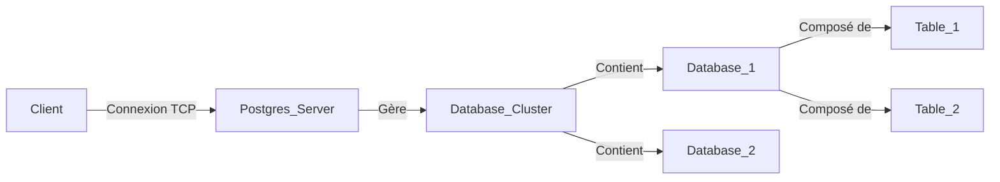

# 1-Introduction aux bases de données relationnelles  
## 2-Présentation de PostgreSQL  
### 1-Installation et configuration de base

---

PostgreSQL est un système de gestion de base de données relationnelle (SGBDR) open source reconnu pour sa robustesse, sa conformité aux standards, sa richesse fonctionnelle et ses performances. Ce guide décrit les étapes essentielles pour installer PostgreSQL et réaliser une configuration minimale afin de démarrer rapidement.

---

## 1. Installation de PostgreSQL

### 1.1 Choix de la version

La version stable recommandée actuel (2024) est PostgreSQL 15.x. Elle offre des améliorations en termes de performances, de sécurité et de fonctionnalités.

### 1.2 Installation sur principaux systèmes

#### Sous Linux (exemple Ubuntu)

```bash
sudo apt update
sudo apt install postgresql postgresql-contrib
```

Cette commande installe PostgreSQL ainsi que des modules additionnels souvent utiles (postresql-contrib).

#### Sous Windows

- Télécharger l’installateur officiel depuis le site [PostgreSQL Downloads](https://www.postgresql.org/download/windows/) fourni par EnterpriseDB.
- Exécuter le fichier `.exe` et suivre l’assistant d’installation, définir le mot de passe de l’utilisateur `postgres` et choisir le port (par défaut 5432).

#### Sous macOS

Utiliser Homebrew :

```bash
brew update
brew install postgresql
brew services start postgresql
```

---

## 2. Configuration de base

### 2.1 Démarrage du service PostgreSQL

Une fois installé, le service PostgreSQL doit être démarré. Sur Linux, il peut être contrôlé par systemd :

```bash
sudo systemctl start postgresql
sudo systemctl enable postgresql  # démarrage automatique au boot
```

### 2.2 Accès au serveur de base de données

Se connecter en tant qu’utilisateur `postgres` (super utilisateur par défaut) via la console :

```bash
sudo -i -u postgres
psql
```

Ceci ouvre l’interface interactive `psql` pour exécuter des commandes SQL.

---

## 3. Exemple d’utilisation initiale

### Création d’une base de données

```sql
CREATE DATABASE formation;
```

### Création d’un utilisateur

```sql
CREATE USER alice WITH PASSWORD 'securePwd123';
```

### Attribution de privilèges

```sql
GRANT ALL PRIVILEGES ON DATABASE formation TO alice;
```

---

## 4. Configuration des fichiers principaux

- **pg_hba.conf** : contrôle l’authentification des utilisateurs et l’accès réseau.
- **postgresql.conf** : fichier de configuration général (ports, performances, logs).

Par exemple, pour autoriser une connexion locale par mot de passe dans `pg_hba.conf` :

```
# TYPE  DATABASE        USER            ADDRESS                 METHOD
local   all             all                                     md5
```

Après modification, redémarrer PostgreSQL pour appliquer les changements :

```bash
sudo systemctl restart postgresql
```

---

## 5. Architecture succinte du système PostgreSQL avec Mermaid



---

## Sources utilisées

- Site officiel PostgreSQL, [Documentation 15](https://www.postgresql.org/docs/15/index.html)  
- PostgreSQL, [Téléchargements officiels](https://www.postgresql.org/download/)
- DigitalOcean, [How To Install and Use PostgreSQL on Ubuntu 20.04](https://www.digitalocean.com/community/tutorials/how-to-install-and-use-postgresql-on-ubuntu-20-04)
- PostgreSQL Wiki, [Configuring PostgreSQL](https://wiki.postgresql.org/wiki/Configuring_PostgreSQL)

---

Cette approche pour installer et configurer PostgreSQL donne une base pour commencer à créer, gérer et exploiter des bases de données relationnelles avec ce puissant SGBDR.