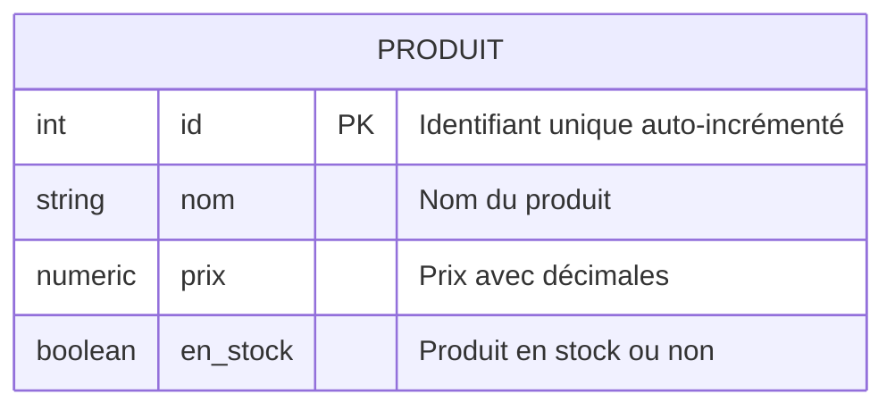

# 1-Introduction aux bases de données relationnelles  
## 2-Présentation de PostgreSQL  
### 2-Syntaxe de base de PostgreSQL

---

PostgreSQL est un Système de Gestion de Bases de Données Relationnelles (SGBDR) doté d’un langage SQL puissant et standardisé. Connaître sa syntaxe de base permet de créer, manipuler et interroger les données efficacement. Cet article présente les commandes fondamentales et leur usage dans PostgreSQL.

---

## 1. Les commandes SQL de base dans PostgreSQL

### 1.1 Création de tables (`CREATE TABLE`)

Pour définir une structure de données, on crée une table avec des colonnes et leurs types de données.

```sql
CREATE TABLE employe (
    id SERIAL PRIMARY KEY,
    nom VARCHAR(50) NOT NULL,
    prenom VARCHAR(50),
    age INTEGER,
    salaire NUMERIC(10,2)
);
```

- `SERIAL` : entier auto-incrémenté, souvent utilisé pour clé primaire.
- `VARCHAR(n)` : chaîne de caractères jusqu’à n caractères.
- `NUMERIC(10,2)` : nombre à précision avec 10 chiffres dont 2 après la virgule.

---

### 1.2 Insertion de données (`INSERT INTO`)

Ajout d’enregistrements dans la table :

```sql
INSERT INTO employe (nom, prenom, age, salaire) VALUES
('Dupont', 'Alice', 30, 3500.00),
('Martin', 'Bob', 45, 4200.50);
```

---

### 1.3 Lecture de données (`SELECT`)

Pour interroger et afficher les données :

```sql
SELECT * FROM employe;
```

Ou filtrer avec une clause WHERE :

```sql
SELECT nom, prenom FROM employe WHERE age > 40;
```

---

### 1.4 Mise à jour (`UPDATE`)

Modifier les données existantes :

```sql
UPDATE employe SET salaire = salaire * 1.05 WHERE age > 40;
```

---

### 1.5 Suppression (`DELETE`)

Supprimer des enregistrements :

```sql
DELETE FROM employe WHERE id = 2;
```

---

## 2. Types de données courants

- `INTEGER`, `SMALLINT` : entiers.
- `SERIAL` : entier auto-incrémenté.
- `VARCHAR(n)`, `TEXT` : chaînes de caractères.
- `NUMERIC(p,s)`, `FLOAT` : nombres décimaux.
- `DATE`, `TIMESTAMP` : dates et horodatages.
- `BOOLEAN` : valeur vraie/faux.

---

## 3. Exemple complet et visualisation Mermaid

Création d'une table simple **Produit** avec ses opérations de base.

```sql
CREATE TABLE produit (
    id SERIAL PRIMARY KEY,
    nom VARCHAR(100) NOT NULL,
    prix NUMERIC(8,2),
    en_stock BOOLEAN DEFAULT TRUE
);

INSERT INTO produit (nom, prix) VALUES 
('Stylo', 1.20),
('Cahier', 2.50),
('Gomme', 0.80);

SELECT * FROM produit WHERE en_stock = true;
```

Diagramme Mermaid décrivant cette table :



---

## 4. Remarques importantes

- PostgreSQL utilise des guillemets doubles `" "` pour délimiter les identifiants sensibles à la casse, mais par défaut, les noms sont convertis en minuscules.
- Les commandes SQL se terminent par un point-virgule `;`.
- La syntaxe SQL est insensible à la casse, mais il est courant d’écrire les mots-clés en majuscules.

---

## Sources utilisées

- Documentation officielle PostgreSQL, [SQL Syntax](https://www.postgresql.org/docs/current/sql-commands.html)
- Tutorialspoint, [PostgreSQL Tutorial](https://www.tutorialspoint.com/postgresql/postgresql_basic_syntax.htm)
- DigitalOcean, [Introduction to PostgreSQL](https://www.digitalocean.com/community/tutorial_series/how-to-use-postgresql)
- W3Schools, [PostgreSQL Tutorial](https://www.w3schools.com/sql/sql_postgresql.asp)

---

Cet aperçu synthétique des commandes de base dans PostgreSQL offre une base solide pour manipuler des données relationnelles et comprendre les concepts SQL fondamentaux appliqués dans ce système.