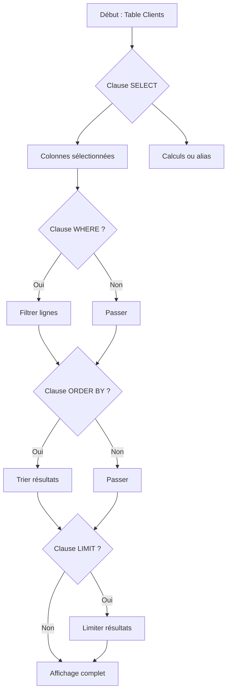

# 2-Requêtes SQL fondamentales  
## 1-Les commandes de base SQL  
### 1-Syntaxe SELECT pour interroger une table

---

La commande **SELECT** est la pierre angulaire du langage SQL, utilisée pour interroger une ou plusieurs tables et extraire les données. Comprendre sa syntaxe et ses options est fondamental pour manipuler les bases relationnelles.

---

## 1. Structure de base de la commande SELECT

La syntaxe générale est :

```sql
SELECT [colonnes]
FROM [table]
[WHERE conditions]
[ORDER BY colonne [ASC|DESC]]
[LIMIT n];
```

- **SELECT** spécifie les colonnes à récupérer.
- **FROM** désigne la table source.
- **WHERE** applique un filtre conditionnel.
- **ORDER BY** trie les résultats.
- **LIMIT** restreint le nombre de lignes retournées.

---

## 2. Exemple simple

Supposons une table **Clients** :

| id | nom       | ville        | age |
|----|-----------|--------------|-----|
| 1  | Dupont    | Paris        | 35  |
| 2  | Martin    | Lyon         | 27  |
| 3  | Leroy     | Marseille    | 42  |

### Requête pour récupérer tous les clients :

```sql
SELECT * FROM Clients;
```

Résultat : toutes les colonnes et lignes de la table.

### Requête pour récupérer uniquement les noms et villes :

```sql
SELECT nom, ville FROM Clients;
```

### Requête avec filtre (`WHERE`)

```sql
SELECT * FROM Clients WHERE age > 30;
```

Retourne Dupont et Leroy.

### Tri des résultats (`ORDER BY`)

```sql
SELECT * FROM Clients ORDER BY age DESC;
```

Trie du plus âgé au plus jeune.

### Limiter les résultats (`LIMIT`)

```sql
SELECT * FROM Clients ORDER BY age DESC LIMIT 2;
```

Affiche les deux clients les plus âgés.

---

## 3. Opérations spécifiques

- **Distinct** : éviter les doublons.

```sql
SELECT DISTINCT ville FROM Clients;
```

- **Alias** : renommer les colonnes dans le résultat.

```sql
SELECT nom AS NomClient, age AS AgeClient FROM Clients;
```

- **Expressions et fonctions** : calculs simples.

```sql
SELECT nom, age + 1 AS age_lan_prochain FROM Clients;
```

---

## 4. Visualisation avec diagramme Mermaid du flux de requête SELECT



---

## 5. Sources utilisées

- Documentation officielle PostgreSQL, [SELECT](https://www.postgresql.org/docs/current/sql-select.html)  
- W3Schools, [SQL SELECT Statement](https://www.w3schools.com/sql/sql_select.asp)  
- TutorialsPoint, [SQL Select Statement](https://www.tutorialspoint.com/sql/sql-select-query.htm)  
- DigitalOcean, [An Introduction to the SQL SELECT Statement](https://www.digitalocean.com/community/tutorials/an-introduction-to-the-sql-select-statement)

---

Ce guide synthétise les applications clés de la commande SELECT, indispensable pour démarrer avec les requêtes dans le langage SQL, montrer le filtrage, tri et limitation des données.