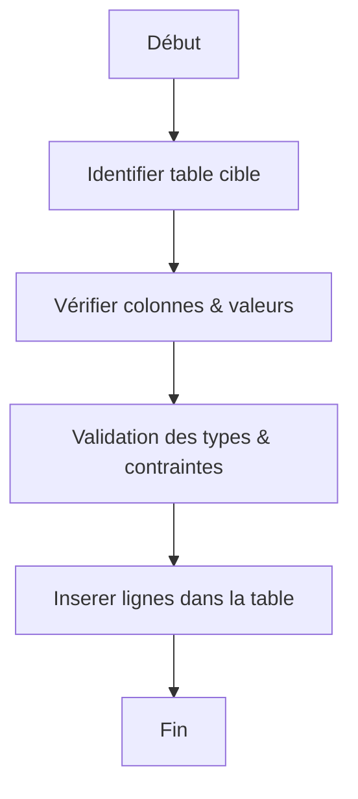

# 2-Requêtes SQL fondamentales  
## 1-Les commandes de base SQL  
### 2-Ajout de données avec INSERT

---

La commande **INSERT** en SQL permet d'insérer de nouvelles données dans une table. Maîtriser cette commande est indispensable pour alimenter une base relationnelle avec des enregistrements.

---

## 1. Syntaxe de base de la commande INSERT

```sql
INSERT INTO table_name [(colonne1, colonne2, ...)]
VALUES (valeur1, valeur2, ...);
```

- `table_name` : nom de la table où insérer les données.
- La liste des colonnes est optionnelle si on fournit des valeurs dans l’ordre exact des colonnes.
- `VALUES` : valeurs correspondant aux colonnes définies.

---

## 2. Exemple simple

Considérons la table **Employe** :

| id (serial) | nom      | prenom | age | salaire  |
|-------------|----------|--------|-----|----------|

Insertion d’un nouvel employé :

```sql
INSERT INTO Employe (nom, prenom, age, salaire)
VALUES ('Dupont', 'Alice', 30, 3500.75);
```

Si la colonne `id` est auto-incrémentée (`SERIAL` ou `IDENTITY`), elle est remplie automatiquement.

---

## 3. Insertion de plusieurs lignes

PostgreSQL et la plupart des SGBD modernes supportent l'insertion multiposte en une seule commande :

```sql
INSERT INTO Employe (nom, prenom, age, salaire) VALUES
('Martin', 'Bob', 45, 4200.00),
('Leroy', 'Claire', 28, 3200.50);
```

---

## 4. Insérer les données issues d'une autre requête

On peut insérer les résultats d’une requête SELECT dans une table :

```sql
INSERT INTO Employe_arhives (nom, prenom, age, salaire)
SELECT nom, prenom, age, salaire FROM Employe WHERE age > 40;
```

---

## 5. Exemples pratiques

### Insérer avec valeurs par défaut

Si une colonne a une valeur par défaut définie, on peut omettre sa valeur :

```sql
INSERT INTO Employe (nom, prenom) VALUES ('Durand', 'Eve');
```

### Insérer en ignorant explicitement des colonnes auto-incrémentées

```sql
INSERT INTO Employe DEFAULT VALUES;
```

Insère une ligne avec toutes les valeurs par défaut.

---

## 6. Diagramme Mermaid illustrant le processus INSERT



---

## 7. Points importants

- Respecter l’ordre des colonnes si aucune liste n’est précisée.
- Les types des valeurs doivent correspondre aux types des colonnes.
- Les contraintes (clé primaire, not null, unique) sont vérifiées lors de l'insertion, sinon une erreur est levée.
- L'insertion multiple optimise les performances par rapport à plusieurs commandes séparées.

---

## Sources utilisées

- Documentation officielle PostgreSQL, [INSERT](https://www.postgresql.org/docs/current/sql-insert.html)  
- W3Schools, [SQL INSERT INTO Statement](https://www.w3schools.com/sql/sql_insert.asp)  
- TutorialsPoint, [SQL Insert Command](https://www.tutorialspoint.com/sql/sql-insert-query.htm)  
- DigitalOcean, [How To Use the SQL INSERT Statement](https://www.digitalocean.com/community/tutorials/how-to-use-the-sql-insert-statement)

---

Le mécanisme d'insertion des données à l'aide de la commande INSERT permet de peupler efficacement les tables. Sa souplesse, via l’insertion unique, multiple, ou à partir d'une requête, s’adapte à différents scénarios en SQL.