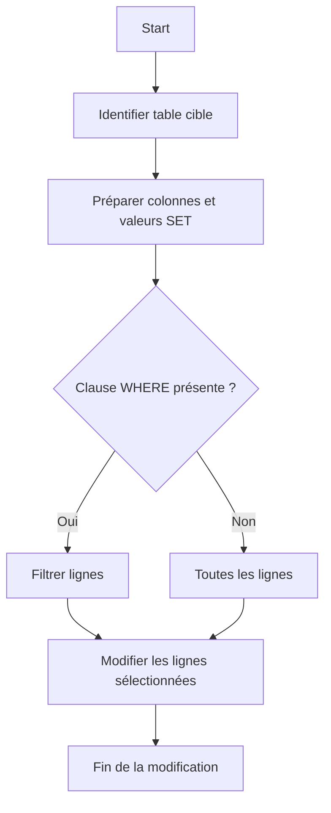

# 2-Requêtes SQL fondamentales  
## 1-Les commandes de base SQL  
### 3-Modification de données avec UPDATE

---

La commande **UPDATE** est utilisée pour modifier les valeurs d’enregistrements existants dans une table. Elle permet d’ajuster, corriger ou mettre à jour les données selon des conditions précises.

---

## 1. Syntaxe de base

```sql
UPDATE nom_de_la_table
SET colonne1 = valeur1, colonne2 = valeur2, ...
[WHERE condition];
```

- La clause `SET` indique quelles colonnes modifier et leurs nouvelles valeurs.
- La clause optionnelle `WHERE` sert à cibler les lignes à mettre à jour.
- **Sans `WHERE`**, toutes les lignes de la table sont modifiées, ce qui peut être dangereux.

---

## 2. Exemples concrets

Considérons la table **Employe** :

| id | nom    | prenom | salaire  |
|----|--------|--------|----------|
| 1  | Dupont | Alice  | 3500.75  |
| 2  | Martin | Bob    | 4200.00  |
| 3  | Leroy  | Claire | 3200.50  |

### Exemple 1 : Mettre à jour le salaire de l’employé Bob

```sql
UPDATE Employe
SET salaire = 4500.00
WHERE prenom = 'Bob';
```

### Exemple 2 : Augmenter le salaire de 5 % pour tous les employés

```sql
UPDATE Employe
SET salaire = salaire * 1.05;
```

### Exemple 3 : Modifier plusieurs colonnes

```sql
UPDATE Employe
SET nom = 'Dupond', salaire = 3600.00
WHERE id = 1;
```

---

## 3. Mise à jour conditionnelle avancée avec expressions logiques

Exemple pour mettre à jour uniquement les employés dont le salaire est inférieur à 3500 :

```sql
UPDATE Employe
SET salaire = 3500.00
WHERE salaire < 3500;
```

---

## 4. Utiliser RETURNING pour obtenir les lignes modifiées

PostgreSQL offre la clause `RETURNING` qui permet d’obtenir les données mises à jour en sortie :

```sql
UPDATE Employe
SET salaire = salaire * 1.10
WHERE id = 3
RETURNING id, nom, salaire;
```

---

## 5. Diagramme Mermaid expliquant le processus UPDATE



---

## 6. Points à retenir

- Attention à toujours utiliser une clause `WHERE` pour éviter de modifier toutes les lignes accidentellement.
- Les expressions dans `SET` peuvent inclure des calculs, des fonctions, ou des sous-requêtes.
- La clause `RETURNING` est spécifique à PostgreSQL et facilite le retour des données mises à jour, utile pour des traitements immédiats.

---

## Sources utilisées

- Documentation official PostgreSQL, [UPDATE](https://www.postgresql.org/docs/current/sql-update.html)  
- W3Schools, [SQL UPDATE Statement](https://www.w3schools.com/sql/sql_update.asp)  
- TutorialsPoint, [SQL Update Query](https://www.tutorialspoint.com/sql/sql-update-query.htm)  
- DigitalOcean, [How to Use SQL UPDATE Statement](https://www.digitalocean.com/community/tutorials/how-to-use-the-sql-update-statement)

---

L’instruction UPDATE constitue un outil puissant pour modifier efficacement les données dans une base relationnelle. Maîtriser ses options garantit des mises à jour ciblées, fiables et sécurisées.