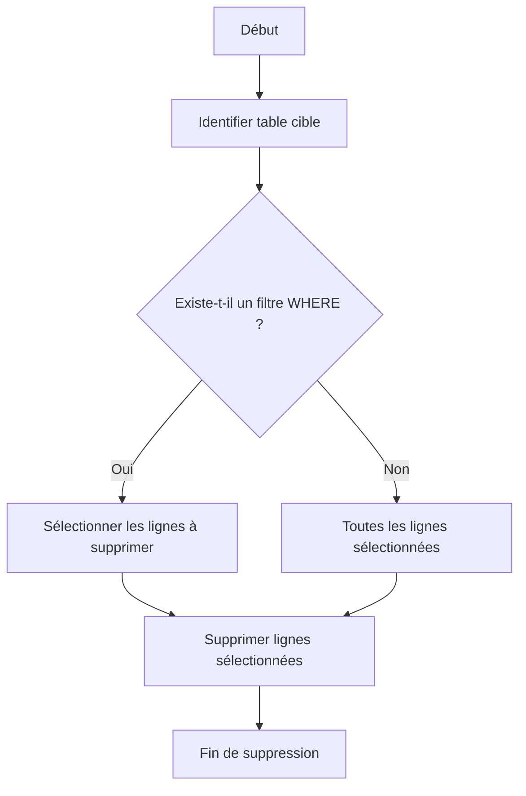

# 2-Requêtes SQL fondamentales  
## 1-Les commandes de base SQL  
### 4-Suppression de données avec DELETE

---

La commande **DELETE** permet de supprimer des enregistrements d’une table selon des critères définis. Une bonne maîtrise de cette commande évite la suppression accidentelle massive des données et assure la cohérence du système.

---

## 1. Syntaxe de la commande DELETE

```sql
DELETE FROM nom_de_la_table
[WHERE condition];
```

- `nom_de_la_table` : table ciblée pour la suppression.
- La clause optionnelle `WHERE` précise les lignes à supprimer.
- **Sans `WHERE`**, toutes les lignes de la table seront supprimées.

---

## 2. Exemples d’utilisation

Considérons la table **Employe** :

| id | nom    | prenom | salaire  |
|----|--------|--------|----------|
| 1  | Dupont | Alice  | 3500.75  |
| 2  | Martin | Bob    | 4200.00  |
| 3  | Leroy  | Claire | 3200.50  |

### Exemple 1 : Supprimer l’employé Bob

```sql
DELETE FROM Employe WHERE prenom = 'Bob';
```

### Exemple 2 : Supprimer tous les employés avec un salaire inférieur à 3300

```sql
DELETE FROM Employe WHERE salaire < 3300;
```

### Exemple 3 : Supprimer tous les enregistrements (vider la table)

```sql
DELETE FROM Employe;
```

---

## 3. Remarques importantes

- Utiliser la clause `WHERE` pour éviter la suppression complète par inadvertance.
- Pour une suppression rapide et vidage de table, la commande `TRUNCATE` est souvent préférée car plus performante, mais elle supprime toutes les lignes sans possibilité de filtrer.

---

## 4. Suppression avec RETURNING dans PostgreSQL

PostgreSQL permet de récupérer les lignes supprimées avec l’instruction `RETURNING` :

```sql
DELETE FROM Employe WHERE salaire < 3300 RETURNING id, nom, salaire;
```

Cette commande supprime tout en renvoyant les données supprimées, pratique pour audits ou traitements ultérieurs.

---

## 5. Diagramme Mermaid illustrant le processus DELETE



---

## 6. Gestion des contraintes et intégrité référentielle

- Lorsque des clés étrangères existent, la suppression peut être bloquée ou provoquer des suppressions en cascade selon la configuration (`ON DELETE CASCADE`, `RESTRICT`).
- Bien vérifier les dépendances avant suppression pour éviter des erreurs ou pertes involontaires.

---

## Sources utilisées

- Documentation officielle PostgreSQL, [DELETE](https://www.postgresql.org/docs/current/sql-delete.html)  
- W3Schools, [SQL DELETE Statement](https://www.w3schools.com/sql/sql_delete.asp)  
- TutorialsPoint, [SQL Delete Query](https://www.tutorialspoint.com/sql/sql-delete-query.htm)  
- DigitalOcean, [How To Use the SQL DELETE Statement](https://www.digitalocean.com/community/tutorials/how-to-use-the-sql-delete-statement)

---

La commande DELETE permet un contrôle précis de la suppression des données. Accompagnée de clauses conditionnelles et des fonctionnalités spécifiques à PostgreSQL, elle contribue à une gestion rigoureuse et sûre des informations dans la base.