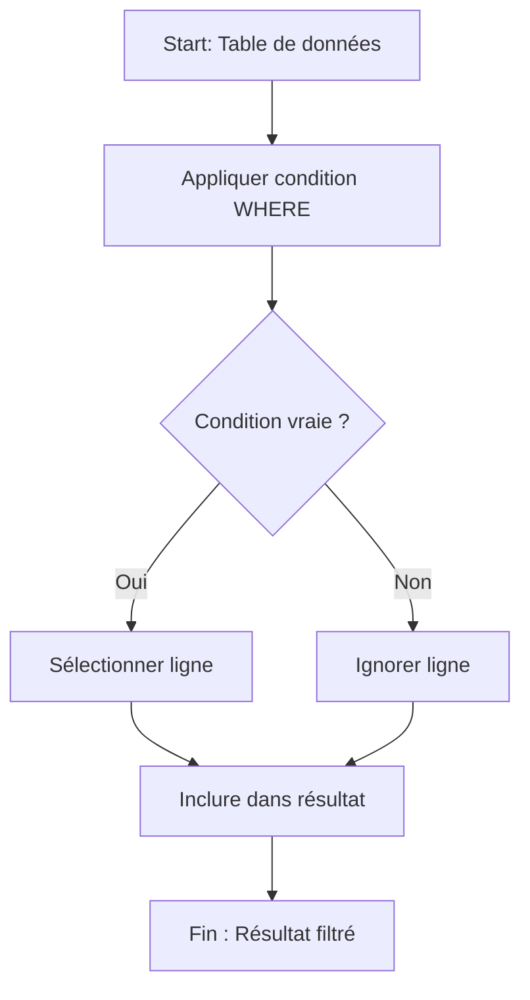

# 2-Requêtes SQL fondamentales  
## 2-Conditions et filtres  
### 1-Utilisation de WHERE pour filtrer les résultats

---

La clause **WHERE** est utilisée dans SQL pour filtrer les lignes retournées par une requête selon des conditions précises. Elle s’applique dans les commandes comme `SELECT`, `UPDATE`, ou `DELETE` pour cibler uniquement les enregistrements répondant à des critères spécifiques.

---

## 1. Syntaxe générale

```sql
SELECT colonnes
FROM table
WHERE condition;
```

- `condition` peut être une expression simple ou complexe combinant plusieurs tests via des opérateurs logiques.

---

## 2. Types d’opérateurs dans WHERE

### 2.1 Opérateurs de comparaison

| Opérateur | Description               | Exemple                   |
|-----------|---------------------------|--------------------------|
| =         | égal                      | age = 30                 |
| <> ou !=  | différent                 | ville <> 'Paris'          |
| >         | supérieur à               | salaire > 2500           |
| <         | inférieur à               | age < 40                 |
| >=        | supérieur ou égal à       | age >= 18                |
| <=        | inférieur ou égal à       | salaire <= 3000          |

### 2.2 Opérateur BETWEEN (inclusif)

```sql
WHERE age BETWEEN 20 AND 30
```

Equivalent à `age >= 20 AND age <= 30`.

### 2.3 Opérateur IN

Permet de tester la valeur dans une liste :

```sql
WHERE ville IN ('Paris', 'Lyon', 'Marseille')
```

### 2.4 Opérateur LIKE avec jokers

Pour la recherche de motifs dans des chaînes.

- `%` : n’importe quelle séquence de caractères.
- `_` : un seul caractère.

```sql
WHERE nom LIKE 'Du%'
```

Trouvera les noms commençant par "Du".

### 2.5 Opérateur IS NULL / IS NOT NULL

Pour tester la présence ou absence de valeur nulle.

---

## 3. Combinaison des conditions avec les opérateurs logiques

| Opérateur | Fonction                                 |
|-----------|-----------------------------------------|
| AND       | toutes les conditions doivent être vraies |
| OR        | au moins une condition doit être vraie    |
| NOT       | inverse la condition                      |

Exemple :

```sql
WHERE age > 25 AND ville = 'Paris'
```

---

## 4. Exemples d’utilisation

### Exemple 1 : Obtenir les clients âgés de plus de 30 ans

```sql
SELECT * FROM Clients WHERE age > 30;
```

### Exemple 2 : Clients vivant à Paris ou Lyon

```sql
SELECT * FROM Clients WHERE ville IN ('Paris', 'Lyon');
```

### Exemple 3 : Clients dont le nom commence par 'Du'

```sql
SELECT * FROM Clients WHERE nom LIKE 'Du%';
```

### Exemple 4 : Clients sans numéro de téléphone renseigné

```sql
SELECT * FROM Clients WHERE telephone IS NULL;
```

---

## 5. Erreur fréquente à éviter

- Omettre la clause `WHERE` lors d’une commande `UPDATE` ou `DELETE` appliquera la modification ou suppression à toutes les lignes.

---

## 6. Diagramme Mermaid sur le fonctionnement de WHERE



---

## Sources utilisées

- Documentation officielle PostgreSQL, [WHERE](https://www.postgresql.org/docs/current/tutorial-select.html#id-1.9.3.14.6)  
- W3Schools, [SQL WHERE Clause](https://www.w3schools.com/sql/sql_where.asp)  
- TutorialsPoint, [SQL WHERE Clause](https://www.tutorialspoint.com/sql/sql-where-clause.htm)  
- DigitalOcean, [An Overview of the WHERE Clause in SQL](https://www.digitalocean.com/community/tutorials/an-overview-of-the-where-clause-in-sql)

---

La clause WHERE est l’outil fondamental de filtrage dans SQL. Comprendre ses opérateurs et combinaisons permet d’extraire précisément les données pertinentes selon des règles métiers définies.