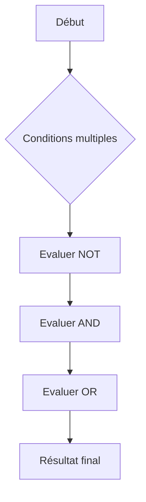

# 2-Requêtes SQL fondamentales  
## 2-Conditions et filtres  
### 2-Opérateurs logiques (AND, OR, NOT)

---

Les opérateurs logiques **AND**, **OR** et **NOT** permettent de combiner ou d’inverser plusieurs conditions dans une clause **WHERE** en SQL. Ils renforcent la précision des filtres pour extraire les données souhaitées à partir de critères multiples ou complexes.

---

## 1. Définition et fonction des opérateurs

| Opérateur | Description                                              |
|-----------|----------------------------------------------------------|
| AND       | Vrai seulement si toutes les conditions sont vraies      |
| OR        | Vrai si au moins une condition est vraie                 |
| NOT       | Inverse la valeur logique d’une condition (vrai → faux) |

---

## 2. Utilisation et exemples

### 2.1 Opérateur AND

Il combine deux conditions ; toutes doivent être vraies pour que l’enregistrement soit sélectionné.

```sql
SELECT * FROM Employe
WHERE age > 30 AND ville = 'Paris';
```

Retourne les employés ayant plus de 30 ans ET vivant à Paris.

---

### 2.2 Opérateur OR

Il sélectionne les enregistrements quand au moins une condition est vraie.

```sql
SELECT * FROM Employe
WHERE age < 25 OR salaire > 4000;
```

Retourne les employés de moins de 25 ans OU avec un salaire supérieur à 4000.

---

### 2.3 Opérateur NOT

Il inverse une condition.

```sql
SELECT * FROM Employe
WHERE NOT ville = 'Lyon';
```

Retourne tous les employés dont la ville **n’est pas** Lyon.

---

## 3. Combinaisons complexes avec parenthèses

Lorsque plusieurs opérateurs sont utilisés, les parenthèses permettent de définir l’ordre d’évaluation.

```sql
SELECT * FROM Employe
WHERE (ville = 'Paris' OR ville = 'Lyon') AND salaire > 3000;
```

Cet exemple sélectionne les employés à Paris ou Lyon **avec** un salaire supérieur à 3000.

---

## 4. Priorités d’évaluation

- `NOT` a la priorité la plus haute.
- `AND` est évalué avant `OR`.
- Utiliser les parenthèses pour clarifier les intentions et éviter les erreurs.

---

## 5. Exemple complet

Table **Employe** :

| id | nom    | ville   | age | salaire  |
|----|--------|---------|-----|----------|
| 1  | Dupont | Paris   | 35  | 3500.75  |
| 2  | Martin | Lyon    | 22  | 4200.00  |
| 3  | Leroy  | Marseille | 45 | 3200.50 |

Requête :

```sql
SELECT * FROM Employe
WHERE (ville = 'Paris' OR ville = 'Lyon') AND NOT age < 30;
```

Résultat : Dupont (Paris, 35 ans), excluant Martin (Lyon, 22 ans).

---

## 6. Diagramme Mermaid illustrant la logique



---

## 7. Sources utilisées

- Documentation officielle PostgreSQL, [Logical Operators](https://www.postgresql.org/docs/current/functions-logical.html)  
- W3Schools, [SQL AND, OR, NOT](https://www.w3schools.com/sql/sql_and_or.asp)  
- TutorialsPoint, [SQL Logical Operators](https://www.tutorialspoint.com/sql/sql-and-or-not-operators.htm)  
- DigitalOcean, [SQL Logical Operators](https://www.digitalocean.com/community/tutorials/sql-logical-operators)

---

La maîtrise des opérateurs logiques AND, OR et NOT apporte une précision essentielle dans la construction des conditions SQL, permettant de combiner filtrages simples en requêtes complexes, ciblant efficacement les données recherchées.