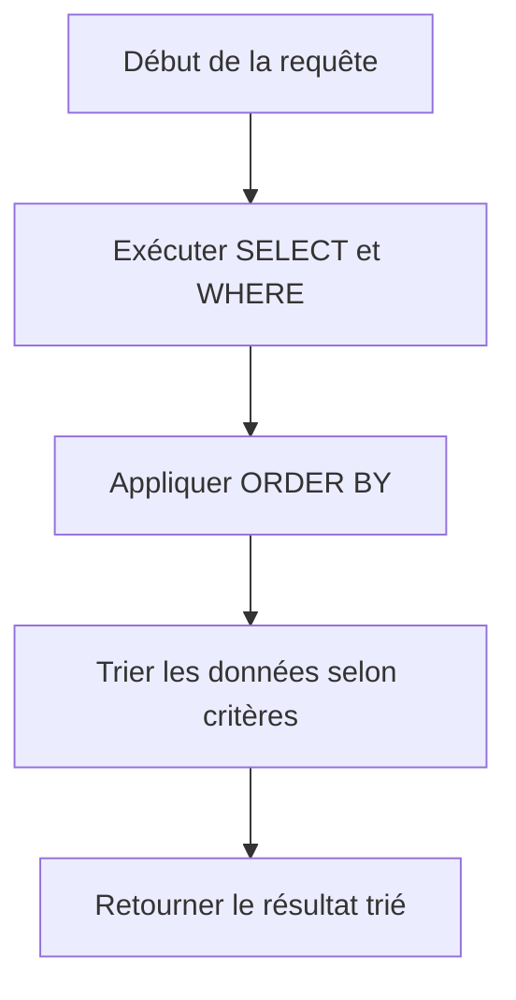

# 2-Requêtes SQL fondamentales  
## 2-Conditions et filtres  
### 3-Tri avec ORDER BY

---

La clause **ORDER BY** en SQL permet de trier les résultats d’une requête selon une ou plusieurs colonnes, dans l’ordre croissant ou décroissant. Elle est utilisée pour organiser la présentation des données et faciliter leur analyse.

---

## 1. Syntaxe de base

```sql
SELECT colonnes
FROM table
[WHERE condition]
ORDER BY colonne1 [ASC | DESC], colonne2 [ASC | DESC], ...;
```

- `ORDER BY` définit la ou les colonnes sur lesquelles s'effectue le tri.
- `ASC` (ascending) indique un tri croissant (par défaut).
- `DESC` (descending) indique un tri décroissant.

---

## 2. Exemples concrets

### Exemple 1 : Trier les employés par nom en ordre alphabétique

```sql
SELECT * FROM Employe
ORDER BY nom ASC;
```

### Exemple 2 : Trier par salaire décroissant

```sql
SELECT * FROM Employe
ORDER BY salaire DESC;
```

### Exemple 3 : Tri multiple (d'abord par ville croissante, puis par âge décroissant)

```sql
SELECT * FROM Employe
ORDER BY ville ASC, age DESC;
```

---

## 3. Utilisation avec des colonnes calculées ou expressions

Il est possible de trier selon des expressions ou alias.

```sql
SELECT nom, prenom, salaire * 12 AS salaire_annuel
FROM Employe
ORDER BY salaire_annuel DESC;
```

---

## 4. Tri avec nombres de colonnes dans ORDER BY

Une écriture alternative utilise la position de la colonne dans la liste de sélection :

```sql
SELECT nom, prenom, age FROM Employe ORDER BY 3 DESC;
```

Ici, le tri s’effectue sur la troisième colonne affichée (`age`).

---

## 5. Diagramme Mermaid illustrant le processus ORDER BY



---

## 6. Points importants

- Le tri est appliqué après la sélection et filtrage (`SELECT` et `WHERE`).
- L’ordre par défaut est croissant.
- Si plusieurs colonnes sont indiquées, le tri s’effectue successivement (colonne1, puis colonne2...).
- Le tri peut affecter les performances sur de grandes tables, surtout sans index adapté.

---

## 7. Sources utilisées

- Documentation PostgreSQL, [ORDER BY](https://www.postgresql.org/docs/current/sql-select.html#SQL-ORDERBY)  
- W3Schools, [SQL ORDER BY Keyword](https://www.w3schools.com/sql/sql_orderby.asp)  
- TutorialsPoint, [SQL ORDER BY Clause](https://www.tutorialspoint.com/sql/sql-order-by.htm)  
- DigitalOcean, [How To Use ORDER BY in SQL](https://www.digitalocean.com/community/tutorials/how-to-use-sql-order-by)

---

L’utilisation d’**ORDER BY** rend les résultats SQL lisibles et organisés selon les besoins métier. Que ce soit pour un tri simple ou complexe, cet opérateur facilite l’analyse et la présentation des données.