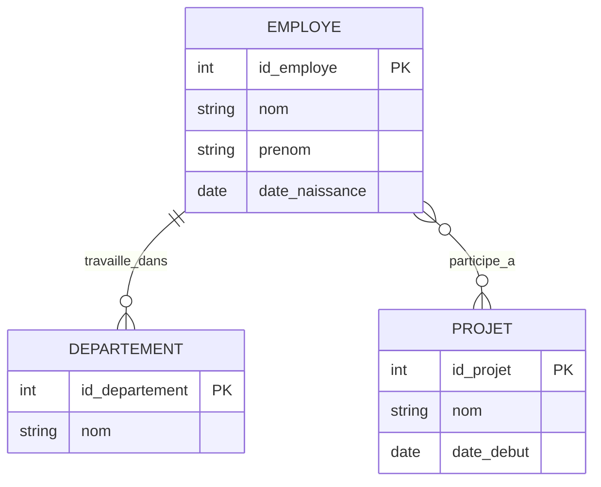

# 3-Modélisation & relations entre tables  
## 1-Modèle entité-association (E-A)  
### 1-Concepts de base du modèle E-A

---

Le modèle Entité-Association (E-A) est une méthode graphique utilisée pour représenter la structure conceptuelle d'une base de données. Il aide à modéliser de manière claire les données, leurs attributs et les relations entre elles avant de passer à la conception physique.

---

## 1. Définition des concepts clés

### 1.1 Entité

Une **entité** représente un objet ou un concept du monde réel ayant une existence propre et indépendant dans le contexte étudié.

- Elle est typiquement modélisée comme un rectangle.
- Exemple : `Employé`, `Produit`, `Client`.

### 1.2 Attribut

Un **attribut** décrit les propriétés ou caractéristiques d’une entité.

- Représenté par une ellipse reliée à l’entité.
- Exemples : pour un Employé, les attributs peuvent être `id_employe`, `nom`, `prénom`, `date_naissance`.

---

### 1.3 Identifiant (clé)

Un ou plusieurs attributs qui permettent d’identifier de manière unique une entité.

- Souvent souligné dans les diagrammes.
- Exemple : `id_employe`.

### 1.4 Relation

Une **relation** représente un lien entre plusieurs entités.

- Représentée par un losange connecté aux entités concernées.
- Exemple : `Travaille_pour` reliant `Employé` et `Département`.

---

## 2. Types de relations

| Type    | Description                                                | Exemples                                 |
|---------|------------------------------------------------------------|-----------------------------------------|
| 1 - 1   | Une entité en relation avec au plus une autre entité      | Une personne possède un passeport       |
| 1 - N   | Une entité liée à plusieurs entités dans l'autre table    | Un département a plusieurs employés     |
| N - N   | Plusieurs entités liées à plusieurs autres entités         | Un étudiant inscrit dans plusieurs cours|

---

## 3. Exemple simplifié de modèle E-A

Considérons le modèle pour une entreprise :

- Entités : `Employe`, `Departement`, `Projet`
- Relations : 
  - Un employé travaille dans un département (1-N)
  - Un employé peut participer à plusieurs projets et un projet peut avoir plusieurs employés (N-N)

### Diagramme Mermaid simplifié

---

## 4. Avantages du modèle E-A

- Visualisation claire des données indépendamment du système de gestion.
- Identification facile des entités majeures, des attributs et des relations.
- Base solide pour traduire en schéma relationnel.

---

## 5. Sources utilisées

- Lucidchart, [Entity Relationship Diagram (ERD) Guide](https://www.lucidchart.com/pages/fr/diagramme-er)  
- Oracle, [Basic Concepts of ER Model](https://docs.oracle.com/cd/B19306_01/server.102/b14220/er_conceps.htm)  
- Wikipedia, [Entity-relationship model](https://en.wikipedia.org/wiki/Entity%E2%80%93relationship_model)  
- TutorialsPoint, [ER Model](https://www.tutorialspoint.com/dbms/dbms_er_model.htm)

---

Le modèle entité-association est la première étape de la modélisation graphique des bases de données relationnelles, facilitant la compréhension des données et leurs relations avant la conception physique. Sa maîtrise assure des bases bien pensées, fiables et évolutives.