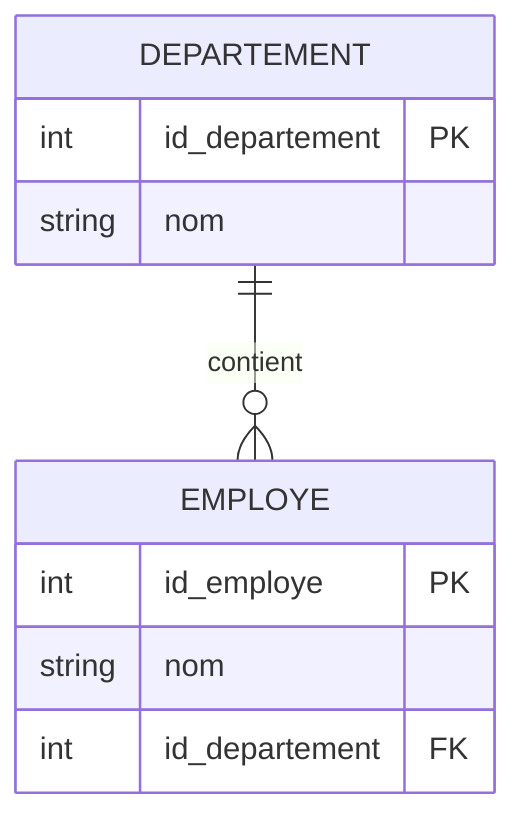

# 3-Modélisation & relations entre tables  
## 1-Modèle entité-association (E-A)  
### 2-Conversion d'un schéma E-A en schéma relationnel

---

La conversion d’un modèle Entité-Association (E-A) en schéma relationnel est une étape fondamentale pour implémenter une base de données relationnelle. Elle consiste à traduire les entités, attributs et relations du modèle conceptuel en tables, colonnes et clés dans la base relationnelle.

---

## 1. Principes généraux de la conversion

### 1.1 Conversion des entités

- Chaque entité devient une **table**.
- Les **attributs** de l’entité deviennent les colonnes de cette table.
- La **clé primaire** (identifiant) de l’entité constitue la clé primaire de la table.

### Exemple

Entité `Employe` avec `id_employe` (PK), `nom`, `prenom`, `date_naissance`

> Devient une table :
> 
> | id_employe (PK) | nom | prenom | date_naissance |

---

### 1.2 Conversion des relations

#### 1.2.1 Relation 1-1 (un à un) 

- Les clés primaires des deux entités sont liées par une clé étrangère.
- On peut choisir de fusionner les deux tables si la relation est obligatoire des deux côtés.

#### 1.2.2 Relation 1-N (un à plusieurs)

- La clé primaire de l’entité du côté « 1 » devient une clé étrangère dans la table côté « N ».

#### 1.2.3 Relation N-N (plusieurs à plusieurs)

- Création d’une nouvelle table relationnelle.
- Cette table contient au minimum les clés primaires des deux entités liées comme clés étrangères, qui forment une clé primaire composée.

---

### 1.3 Conversion des attributs

- Les attributs simples deviennent des colonnes.
- Les attributs composés sont décomposés en attributs simples.
- Les attributs multivalués donnent naissance à une nouvelle table liée par une clé étrangère.

---

## 2. Exemple complet

### Modèle E-A simplifié

- Entités : `Employe (id_employe, nom)`, `Departement (id_departement, nom)`
- Relation 1-N : Un `Departement` a plusieurs `Employe`.

---

### Conversion en schéma relationnel

| Employe         |  
|-----------------|  
| id_employe (PK) |  
| nom             |  
| id_departement (FK) |

| Departement     |  
|----------------|  
| id_departement (PK) |  
| nom            |  

La colonne `id_departement` dans `Employe` fait référence à la table `Departement`.

---

## 3. Diagramme Mermaid illustrant la conversion

---

## 4. Remarques supplémentaires

- Pour les relations N-N, la table de relation peut contenir aussi des attributs propres à la relation.
- Une bonne modélisation garantit l’intégrité référentielle grâce aux clés primaires et étrangères.
- Les colonnes doivent respecter les types de données appropriés issus du modèle E-A.

---

## 5. Sources utilisées

- Oracle, [Mapping ER Model to Relational Model](https://docs.oracle.com/cd/B19306_01/server.102/b14220/rel_model.htm)  
- TutorialsPoint, [ER to Relational Mapping](https://www.tutorialspoint.com/dbms/dbms_er_to_relational.htm)  
- GeeksforGeeks, [Mapping ER Model to Relational Model](https://www.geeksforgeeks.org/mapping-er-model-to-relational-model/)  
- Wikipedia, [Entity–relationship model#Mapping to relations](https://en.wikipedia.org/wiki/Entity%E2%80%93relationship_model#Mapping_to_relations)

---

La conversion E-A vers relationnel transforme la représentation conceptuelle en tables exploitables en base relationnelle. Cette étape organise les données et leurs liens en structures claires, facilitant la manipulation et le stockage efficace dans les systèmes SQL.