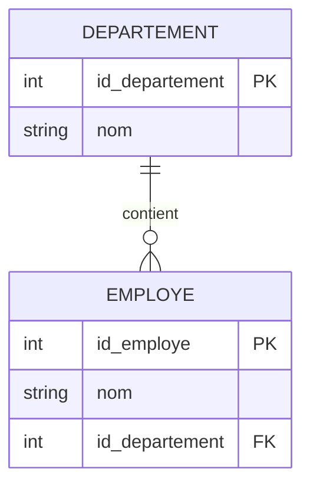

# 3-Modélisation & relations entre tables  
## 2-Relations entre tables  
### 1-Définir les clés primaires et étrangères

---

Dans une base de données relationnelle, les clés primaires et étrangères sont des concepts essentiels pour garantir l’intégrité des données et modéliser les relations entre différentes tables.

---

## 1. Clé primaire (Primary Key)

### 1.1 Définition

- La **clé primaire** est un ou plusieurs attributs qui identifient de façon unique chaque enregistrement d’une table.
- Elle ne peut contenir de valeurs nulles.
- Elle assure l’unicité des lignes.

### 1.2 Exemple

Table `Employe` :

| id_employe (PK) | nom     | departement  |
|-----------------|---------|--------------|
| 1               | Dupont  | Marketing    |
| 2               | Martin  | Informatique |

- `id_employe` est la clé primaire, identifiant unique pour chaque employé.

---

## 2. Clé étrangère (Foreign Key)

### 2.1 Définition

- La **clé étrangère** est un ou plusieurs attributs dans une table qui font référence à la clé primaire d’une autre table.
- Elle sert à établir et maintenir les relations entre les tables.
- Permet d’assurer la cohérence référentielle.

### 2.2 Exemple

Tables `Employe` et `Departement` :

| Departement         |  
|--------------------|  
| id_departement (PK) | nom      |  
| 10                  | Marketing|  
| 20                  | Informatique|

Dans la table `Employe` :

| id_employe (PK) | nom     | id_departement (FK) |  
|-----------------|---------|---------------------|  
| 1               | Dupont  | 10                  |  
| 2               | Martin  | 20                  |

- `id_departement` dans `Employe` est une clé étrangère pointant vers la table `Departement`.

---

## 3. Règles d’intégrité

- Une valeur de clé étrangère doit toujours correspondre à une valeur existante dans la table référencée (clé primaire).
- On ne peut pas supprimer un enregistrement d’une table référencée tant qu’il existe des enregistrements liés via clé étrangère (sauf en configurant des règles spécifiques de suppression en cascade).
- La clé primaire est unique et non nulle.

---

## 4. Exemple de déclaration SQL

```sql
CREATE TABLE Departement (
    id_departement INT PRIMARY KEY,
    nom VARCHAR(50)
);

CREATE TABLE Employe (
    id_employe INT PRIMARY KEY,
    nom VARCHAR(50),
    id_departement INT,
    CONSTRAINT fk_departement 
        FOREIGN KEY (id_departement) 
        REFERENCES Departement(id_departement)
);
```

---

## 5. Diagramme Mermaid illustrant les clés primaires et étrangères



---

## 6. Sources utilisées

- PostgreSQL Documentation, [Primary Keys](https://www.postgresql.org/docs/current/ddl-constraints.html#DDL-CONSTRAINTS-PRIMARY-KEYS)  
- W3Schools, [SQL FOREIGN KEY Constraint](https://www.w3schools.com/sql/sql_foreignkey.asp)  
- TutorialsPoint, [SQL Primary and Foreign Key](https://www.tutorialspoint.com/sql/sql-primary-key.htm)  
- Oracle Docs, [Foreign Key Constraints](https://docs.oracle.com/cd/B19306_01/server.102/b14220/clauses002.htm#i1007289)

---

Les clés primaires garantissent l'unicité des données dans une table, tandis que les clés étrangères établissent des liens entre les tables, permettant d'organiser les données sous forme de relations cohérentes dans une base relationnelle. Leur bonne définition est capitale pour assurer l'intégrité et faciliter les requêtes efficaces.