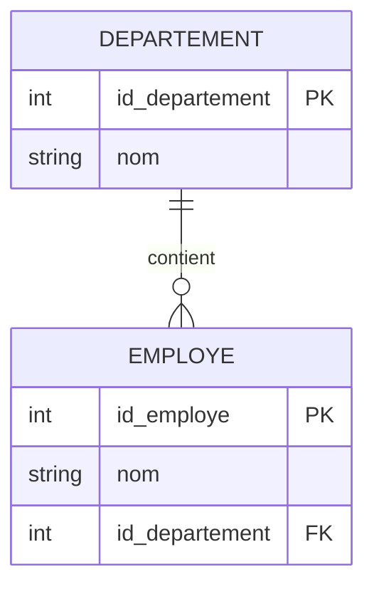

# 3-Modélisation & relations entre tables  
## 2-Relations entre tables  
### 2-Contraintes d'intégrité référentielle

---

Les contraintes d’intégrité référentielle garantissent la cohérence et la validité des données entre tables liées par des relations, notamment par l’utilisation des clés étrangères. Elles empêchent la création de liens invalides et protègent la base de données des anomalies.

---

## 1. Définition de l’intégrité référentielle

L’intégrité référentielle impose que toute valeur d’une clé étrangère dans une table corresponde obligatoirement à une valeur existante dans la clé primaire de la table référencée.

---

## 2. Mécanismes principaux

### 2.1 Restriction (RESTRICT)

Empêche la suppression ou modification d’une ligne référencée tant qu’il existe des enregistrements dépendants.

### 2.2 Cascade (CASCADE)

La suppression ou mise à jour d’une clé primaire entraîne la suppression ou mise à jour automatique des lignes dans la table liée.

### 2.3 Set NULL (SET NULL)

La clé étrangère des enregistrements dépendants est mise à `NULL` quand la ligne référencée est supprimée ou modifiée.

### 2.4 Set Default (SET DEFAULT)

La clé étrangère est remplacée par une valeur par défaut spécifiée.

---

## 3. Exemple pratique avec SQL

Création des tables `Departement` et `Employe` avec intégrité référentielle :

```sql
CREATE TABLE Departement (
    id_departement INT PRIMARY KEY,
    nom VARCHAR(50)
);

CREATE TABLE Employe (
    id_employe INT PRIMARY KEY,
    nom VARCHAR(50),
    id_departement INT,
    CONSTRAINT fk_dept
        FOREIGN KEY (id_departement)
        REFERENCES Departement(id_departement)
        ON DELETE CASCADE
        ON UPDATE RESTRICT
);
```

- `ON DELETE CASCADE` : suppression d’un département supprime aussi ses employés.
- `ON UPDATE RESTRICT` : interdit la modification d’un `id_departement` si lié à des employés.

---

## 4. Illustration Mermaid du comportement CASCADE



*Lors de la suppression d'un département, tous les employés liés sont automatiquement supprimés.*

---

## 5. Impact sur la cohérence des données

- Empêche les orphelins (enregistrements dépendants sans référence valide).
- Facilite la maintenance des données liées.
- Assure que les relations entre données restent synchronisées.

---

## 6. Sources utilisées

- PostgreSQL Documentation, [Referential Integrity](https://www.postgresql.org/docs/current/ddl-constraints.html#DDL-CONSTRAINTS-FK)  
- W3Schools, [SQL FOREIGN KEY Constraint](https://www.w3schools.com/sql/sql_foreignkey.asp)  
- Oracle Docs, [Integrity Constraints](https://docs.oracle.com/cd/B19306_01/server.102/b14220/clauses002.htm#REFRN10252)  
- TutorialsPoint, [SQL Integrity Constraints](https://www.tutorialspoint.com/sql/sql-integrity-constraints.htm)

---

L’intégrité référentielle est un pilier de la qualité des bases de données relationnelles. Configurer adéquatement les contraintes d’action sur suppression et mise à jour évite les incohérences, garantissant la fiabilité des liens entre les données.