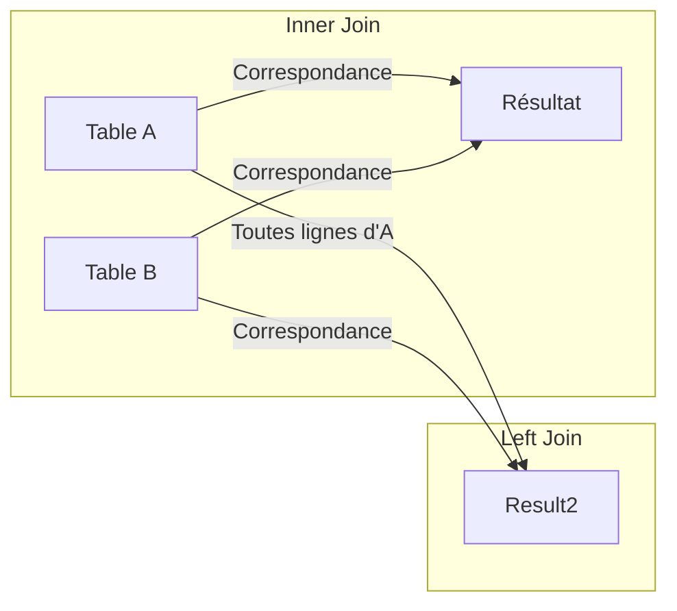

# 4-Jointures & requêtes complexes  
## 1-Types de jointures  
### 1-Jointure interne (INNER JOIN)

---

Une **jointure interne** (`INNER JOIN`) est un opérateur SQL fondamental permettant de combiner les lignes de deux ou plusieurs tables en fonction d’une condition de correspondance. Elle ne conserve que les lignes présentant des valeurs associées dans les deux tables.

---

## 1. Définition et principe

- L'`INNER JOIN` retourne uniquement les enregistrements pour lesquels la condition de jointure est vraie dans toutes les tables jointes.
- Si une ligne d’une table n’a pas de correspondance dans l’autre, elle n’apparaît pas dans le résultat.

---

## 2. Syntaxe

```sql
SELECT colonnes
FROM table1
INNER JOIN table2
ON table1.colonne_commune = table2.colonne_commune;
```

---

## 3. Exemple concret

Tables `Employe` et `Departement` :

| Employe               |  
|-----------------------|  
| id_employe | nom      | id_departement |  
| 1          | Dupont   | 10             |  
| 2          | Martin   | 20             |  
| 3          | Durand   | NULL           |

| Departement           |  
|----------------------|  
| id_departement | nom  |  
| 10            | Marketing   |  
| 20            | Informatique|

Requête `INNER JOIN` :

```sql
SELECT e.nom AS employe, d.nom AS departement
FROM Employe e
INNER JOIN Departement d ON e.id_departement = d.id_departement;
```

Résultat :

| employe | departement  |  
|---------|--------------|  
| Dupont  | Marketing    |  
| Martin  | Informatique |

- L’employé `Durand` n'apparaît pas car son `id_departement` est `NULL` (pas de correspondance).

---

## 4. Comparaison avec autres jointures (schéma Mermaid)



L’`INNER JOIN` sélectionne uniquement les données des deux tables qui correspondent, contrairement à la jointure gauche (`LEFT JOIN`) qui conserve toutes les lignes de la table de gauche.

---

## 5. Précisions complémentaires

- La condition de jointure porte souvent sur les clés primaires et étrangères.
- `INNER JOIN` est équivalent à écrire une clause `WHERE` combinant les tables, mais la syntaxe explicite améliore la lisibilité.
- Utilisé massivement dans les requêtes relationnelles pour croiser et filtrer correctement les données.

---

## 6. Sources utilisées

- SQL Tutorial, [INNER JOIN](https://www.sqltutorial.org/sql-inner-join/)  
- W3Schools, [SQL INNER JOIN Keyword](https://www.w3schools.com/sql/sql_join_inner.asp)  
- PostgreSQL Documentation, [JOIN clauses](https://www.postgresql.org/docs/current/tutorial-join.html)  
- GeeksforGeeks, [SQL INNER JOIN](https://www.geeksforgeeks.org/sql-inner-join-using-select-statement/)

---

La jointure interne (`INNER JOIN`) est une technique de base, concentrée sur la sélection d’enregistrements ayant une correspondance dans toutes les tables impliquées. Elle constitue la pierre angulaire du croisement de données dans les systèmes relationnels.