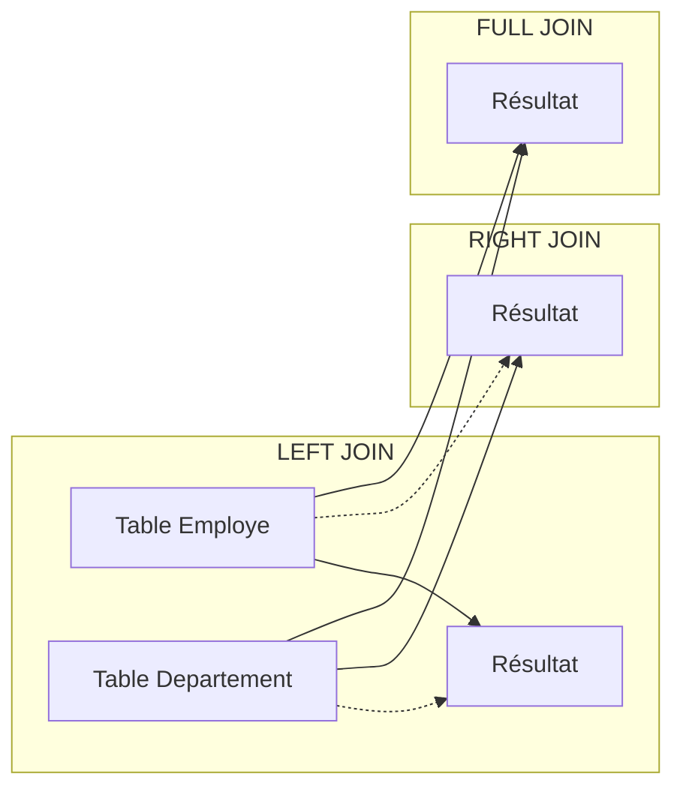

# 4-Jointures & requêtes complexes  
## 1-Types de jointures  
### 2-Jointures externes (LEFT, RIGHT, FULL JOIN)

---

Les jointures externes permettent de conserver l’ensemble des enregistrements d’une ou des deux tables impliquées dans la jointure, même s’il n’existe pas de correspondance dans l’autre table. Elles viennent compléter l'`INNER JOIN` en permettant de récupérer également les données non appariées.

---

## 1. Types de jointures externes

### 1.1 LEFT JOIN (Jointure externe gauche)

- Retourne **toutes les lignes** de la table de gauche, et les lignes correspondantes de la table droite.
- Si aucune correspondance, les colonnes de la table droite contiennent `NULL`.

### 1.2 RIGHT JOIN (Jointure externe droite)

- Retourne **toutes les lignes** de la table de droite, et les lignes correspondantes de la table gauche.
- Les colonnes de la table gauche sont `NULL` s’il n’y a pas de correspondance.

### 1.3 FULL JOIN (Jointure externe complète)

- Combine les effets du `LEFT JOIN` et `RIGHT JOIN`.
- Retourne **toutes les lignes** des deux tables, avec des `NULL` là où il n’y a pas de correspondance.

---

## 2. Exemple pratique avec les tables `Employe` et `Departement`

| Employe               |  
|-----------------------|  
| id_employe | nom      | id_departement |  
| 1          | Dupont   | 10             |  
| 2          | Martin   | 20             |  
| 3          | Durand   | NULL           |

| Departement           |  
|----------------------|  
| id_departement | nom  |  
| 10            | Marketing   |  
| 20            | Informatique|  
| 30            | RH          |

---

### 2.1 LEFT JOIN

```sql
SELECT e.nom AS employe, d.nom AS departement
FROM Employe e
LEFT JOIN Departement d ON e.id_departement = d.id_departement;
```

| employe | departement  |  
|---------|--------------|  
| Dupont  | Marketing    |  
| Martin  | Informatique |  
| Durand  | NULL         |  

- Tous les employés sont affichés, même Durand sans département.

---

### 2.2 RIGHT JOIN

```sql
SELECT e.nom AS employe, d.nom AS departement
FROM Employe e
RIGHT JOIN Departement d ON e.id_departement = d.id_departement;
```

| employe | departement  |  
|---------|--------------|  
| Dupont  | Marketing    |  
| Martin  | Informatique |  
| NULL    | RH           |

- Tous les départements sont affichés, même RH sans employé.

---

### 2.3 FULL JOIN

```sql
SELECT e.nom AS employe, d.nom AS departement
FROM Employe e
FULL JOIN Departement d ON e.id_departement = d.id_departement;
```

| employe | departement  |  
|---------|--------------|  
| Dupont  | Marketing    |  
| Martin  | Informatique |  
| Durand  | NULL         |  
| NULL    | RH           |

- Affiche tous les employés et tous les départements, avec `NULL` quand pas de correspondance.

---

## 3. Visualisation Mermaid simplifiée



---

## 4. Points importants

- `LEFT JOIN` est le plus utilisé pour récupérer une table principale et ses données associées éventuelles.
- Le choix entre `LEFT`, `RIGHT` ou `FULL` dépend de la priorité donnée aux tables et du besoin métier.
- Tous ces types de jointures introduisent potentiellement des `NULL` dans le résultat.
- Certains SGBD ne supportent pas nativement `FULL JOIN` (exemple : MySQL avant 8.0).

---

## 5. Sources utilisées

- W3Schools, [SQL LEFT JOIN](https://www.w3schools.com/sql/sql_join_left.asp)  
- PostgreSQL Documentation, [Outer Joins](https://www.postgresql.org/docs/current/tutorial-join.html)  
- GeeksforGeeks, [SQL Joins](https://www.geeksforgeeks.org/sql-joins-with-examples/)  
- SQL Server Docs, [Full Outer Join](https://docs.microsoft.com/en-us/sql/t-sql/queries/from-transact-sql#full-outer-join)

---

Les jointures externes permettent d’élargir la portée des résultats en conservant les données orphelines d’une table. Cette souplesse est très utile pour analyser des ensembles incomplets ou comparer deux tables aux enregistrements partiellement appariés.