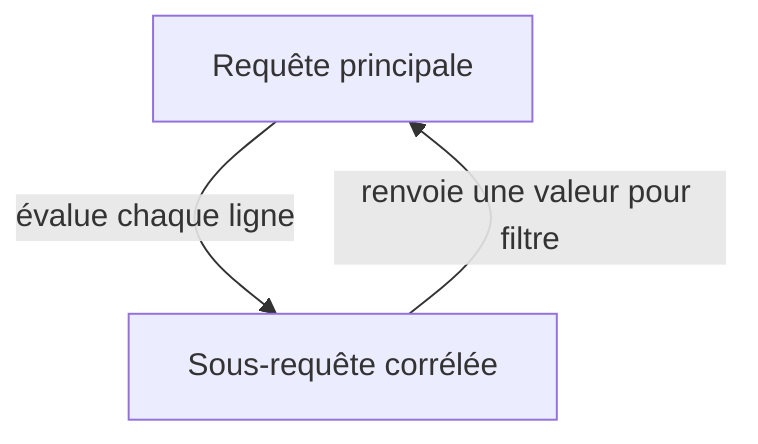

# 4-Jointures & requêtes complexes  
## 2-Requêtes imbriquées et agrégations  
### 1-Sous-requêtes (subqueries)

---

Les sous-requêtes, ou *subqueries*, sont des requêtes SQL incluses dans une autre requête. Elles permettent d'effectuer des opérations en plusieurs étapes, en utilisant le résultat d'une requête comme condition ou source de données dans une autre. C'est un outil puissant pour écrire des requêtes complexes et dynamiques.

---

## 1. Qu’est-ce qu’une sous-requête ?

- C’est une requête placée à l’intérieur d’une autre (la requête *principale*).
- Elle peut apparaître dans différentes parties d’une requête SQL: la clause `SELECT`, `WHERE`, `FROM`, voire `HAVING`.
- Le résultat de la sous-requête est utilisé pour filtrer, calculer ou contrôler les données dans la requête englobante.

---

## 2. Types de sous-requêtes

| Type                  | Description                                                                                     |
|-----------------------|-------------------------------------------------------------------------------------------------|
| Sous-requête scalaire  | Retourne une seule valeur (un seul enregistrement et une seule colonne).                        |
| Sous-requête corrélée | Dépend de la requête parente, elle est évaluée pour chaque ligne traitée par la requête externe. |
| Sous-requête dans `FROM` | Fournit un jeu de résultats temporaire agissant comme une table.                             |

---

## 3. Exemples concrets

### 3.1 Sous-requête simple dans `WHERE`

Trouver les employés dont le département est le même que celui de l’employé numéro 1.

```sql
SELECT nom
FROM Employe
WHERE id_departement = (
    SELECT id_departement
    FROM Employe
    WHERE id_employe = 1
);
```

---

### 3.2 Sous-requête corrélée

Lister les employés qui ont un salaire supérieur à la moyenne des salaires de leur département.

```sql
SELECT nom, salaire
FROM Employe e1
WHERE salaire > (
    SELECT AVG(salaire)
    FROM Employe e2
    WHERE e2.id_departement = e1.id_departement
);
```

---

### 3.3 Sous-requête dans `FROM`

Compter le nombre d’employés par département, puis sélectionner les départements ayant plus de 5 employés.

```sql
SELECT departement, nb_employes
FROM (
    SELECT id_departement AS departement, COUNT(*) AS nb_employes
    FROM Employe
    GROUP BY id_departement
) AS sous_requete
WHERE nb_employes > 5;
```

---

## 4. Représentation Mermaid — Concept de sous-requête corrélée



---

## 5. Points importants

- Les sous-requêtes corélées peuvent être coûteuses car évaluées ligne par ligne.
- Les SGBD optimisent souvent les sous-requêtes non corrélées plus facilement.
- Alternatives comme les jointures (JOIN) sont parfois plus performantes selon le contexte.
- Les sous-requêtes scalaires doivent retourner une seule valeur, sinon une erreur est générée.

---

## 6. Sources utilisées

- W3Schools, [SQL Subqueries](https://www.w3schools.com/sql/sql_subqueries.asp)  
- PostgreSQL Documentation, [Subqueries](https://www.postgresql.org/docs/current/tutorial-subqueries.html)  
- Oracle Docs, [Subqueries](https://docs.oracle.com/cd/B28359_01/server.111/b28286/queries006.htm)  
- SQL Server Docs, [Subqueries (Transact-SQL)](https://docs.microsoft.com/en-us/sql/t-sql/queries/subqueries-transact-sql)

---

Les sous-requêtes offrent une façon flexible et puissante d’écrire des requêtes SQL complexes. Savoir maîtriser leur syntaxe et leur fonctionnement permet d’exprimer des conditions et filtrages avancés tout en structurant clairement les requêtes.