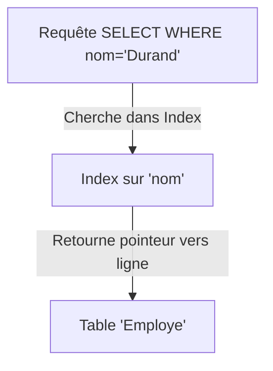

# 5-Index & performance  
## 1-Introduction aux index  
### 1-Concept d'index dans une base relationnelle

---

Un **index** dans une base relationnelle est une structure de données utilisée pour accélérer les opérations de recherche et de tri dans une table. Il fonctionne comme un index dans un livre, permettant de localiser rapidement des lignes sans parcourir toute la table.

---

## 1. Qu’est-ce qu’un index ?

- C’est une structure généralement basée sur un arbre (ex : arbre B+).
- Il stocke les valeurs d’une ou plusieurs colonnes ainsi qu’un pointeur vers la ligne correspondante dans la table.
- Les index facilitent surtout les requêtes avec des conditions (`WHERE`), des jointures, et des tris (`ORDER BY`).

---

## 2. Fonctionnement

Plutôt que de scanner chaque ligne d’une table, le système de gestion de base de données (SGBD) utilise l'index pour trouver rapidement les emplacements des lignes voulues.

Exemple : Rechercher un employé par son `id` est très rapide si un index est défini sur la colonne `id`.

---

## 3. Exemple de création d’index en SQL

Création d’un index simple sur la colonne `nom` de la table `Employe` :

```sql
CREATE INDEX idx_nom
ON Employe(nom);
```

Cet index permet d’optimiser des requêtes comme :

```sql
SELECT * FROM Employe WHERE nom = 'Durand';
```

---

## 4. Types courants d’index

| Type             | Description                                                                                   |
|------------------|----------------------------------------------------------------------------------------------|
| Index B-tree     | Structure la plus courante, efficace pour recherches d’égalité et d'intervalle                |
| Index hash        | Optimisé pour recherche d’égalité uniquement                                                 |
| Index bitmap      | Utilisé sur colonnes avec faible cardinalité, fréquemment en Data Warehouses                 |
| Index full-text  | Pour recherche sur données textuelles                                                        |

---

## 5. Impact sur la performance

- **Avantages :** Accélération significative des requêtes de sélection, jointures et tris.
- **Inconvénients :** Coût accru lors des opérations d’insertion, mise à jour, ou suppression, car l’index doit être mis à jour.
- Utiliser les index judicieusement selon la fréquence et nature des requêtes.

---

## 6. Illustration Mermaid simplifiée



---

## 7. Sources utilisées

- PostgreSQL Documentation, [Indexes](https://www.postgresql.org/docs/current/indexes.html)  
- Oracle Docs, [Overview of Indexes](https://docs.oracle.com/cd/B19306_01/server.102/b14200/indexes.htm)  
- SQL Server Docs, [Indexes](https://docs.microsoft.com/en-us/sql/relational-databases/indexes/indexes)  
- W3Schools, [SQL Indexes](https://www.w3schools.com/sql/sql_create_index.asp)

---

Les index sont un outil essentiel pour améliorer la performance des requêtes SQL. Ils réduisent le temps de recherche en évitant le parcours intégral des tables, mais nécessitent une gestion équilibrée pour ne pas dégrader les performances d’écriture.