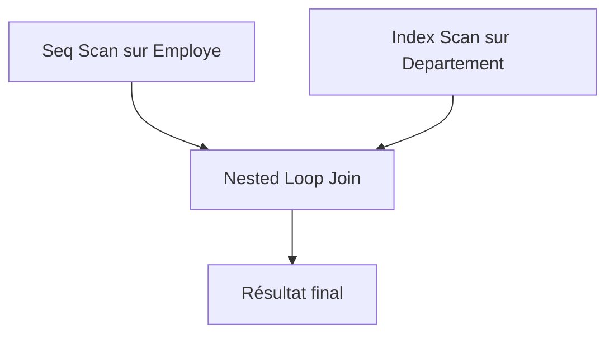

# 5-Index & performance  
## 2-Optimisation des requêtes  
### 1-Analyse des plans d'exécution

---

L’analyse du **plan d’exécution** est une méthode fondamentale pour comprendre comment un Système de Gestion de Base de Données (SGBD) exécute une requête SQL. Elle révèle le chemin choisi par le moteur de requête pour accéder et manipuler les données, ce qui permet d’identifier les points forts ou faibles en termes de performance.

---

## 1. Qu’est-ce qu’un plan d’exécution ?

- Une représentation détaillée des étapes que le SGBD réalise pour exécuter une requête.
- Indique les opérations internes : scans, index seeks, jointures, tris, filtres, agrégations.
- Peut être affichée sous forme textuelle, graphique ou hiérarchique selon l’outil SGBD.

---

## 2. Pourquoi analyser un plan d’exécution ?

- Pour détecter les opérations coûteuses, comme les scans complets de tables (`Seq Scan`), les jointures inefficaces ou les tris non indexés.
- Pour identifier les index utiles ou manquants.
- Pour vérifier si la requête est optimisée ou doit être réécrite.
- Pour anticiper l'impact des volumes de données croissants.

---

## 3. Outils et commandes

| SGBD          | Commande / Outil                          | Description                          |
|---------------|------------------------------------------|------------------------------------|
| PostgreSQL    | `EXPLAIN [ANALYZE] <requête>`             | Affiche le plan d’exécution (avec ou sans exécution réelle) |
| MySQL         | `EXPLAIN <requête>`                       | Rapporte plan simplifié, infos sur index utilisés |
| SQL Server    | `SET SHOWPLAN_ALL ON` / SSMS graphical plan | Plan sous forme textuelle ou graphique |
| Oracle        | `EXPLAIN PLAN FOR <requête>` + `DBMS_XPLAN.DISPLAY` | Visualisation détaillée du plan |

---

## 4. Interprétation d’un exemple PostgreSQL

```sql
EXPLAIN ANALYZE 
SELECT * FROM Employe WHERE nom = 'Durand';
```

**Exemple de sortie simplifiée :**

```
Index Scan using idx_nom on Employe  (cost=0.15..8.27 rows=1 width=100)
  Index Cond: (nom = 'Durand')
Planning Time: 0.1 ms
Execution Time: 0.5 ms
```

- *Index Scan* : utilisation de l’index `idx_nom` pour chercher `nom='Durand'`.
- *Cost* représente une estimation du coût d’exécution.
- *Rows* est le nombre estimé de lignes retournées.
- *Execution Time* est le temps réel consommé.

---

## 5. Exemples d’opérations fréquentes dans les plans

| Opération      | Description                              | Impact typique sur performance       |
|----------------|------------------------------------------|-------------------------------------|
| Seq Scan       | Parcours complet de la table             | Coût élevé sur grandes tables       |
| Index Scan     | Recherche via un index                    | Accès rapide, faible coût            |
| Nested Loop    | Jointure imbriquée ligne à ligne         | Très coûteux avec grands ensembles  |
| Hash Join      | Jointure utilisant une table hashée      | Efficace pour grandes tables         |
| Sort           | Tri des résultats                         | Peut consommer beaucoup de ressources|

---

## 6. Diagramme Mermaid – Exemple simplifié d’un plan



Ce plan illustre une jointure entre deux tables où `Employe` est scannée entièrement et `Departement` est accédée via un index.

---

## 7. Optimisation basée sur les plans d’exécution

- Remplacer les *Seq Scan* coûteux par des *Index Scan* en créant des index pertinents.
- Éviter les *Nested Loops* lorsque possible, privilégier *Hash Join* ou *Merge Join* selon les cas.
- Simplifier ou découper une requête trop complexe.
- S’assurer que les statistiques des tables sont à jour pour une bonne estimation par le SGBD.

---

## 8. Sources utilisées

- PostgreSQL Documentation, [Using EXPLAIN](https://www.postgresql.org/docs/current/using-explain.html)  
- MySQL Docs, [EXPLAIN Syntax](https://dev.mysql.com/doc/refman/8.0/en/explain.html)  
- Microsoft Docs, [Showplan Statements](https://docs.microsoft.com/en-us/sql/relational-databases/performance/showplan-statements-graphical-and-text)  
- Oracle Docs, [Explain Plan](https://docs.oracle.com/cd/B19306_01/server.102/b14200/ex_plan.htm)  

---

La lecture et l’analyse des plans d’exécution offrent un aperçu direct du comportement interne du moteur SQL. Comprendre ces plans permet d’orienter efficacement les optimisations et d’améliorer notablement la rapidité d’exécution des requêtes.