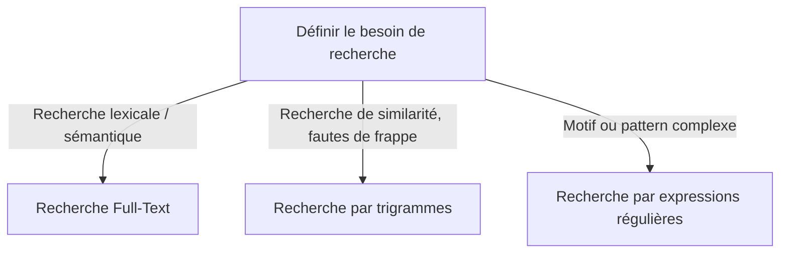

# 6-Recherche Full-Text & alternatives  
## 2-Alternatives et bonnes pratiques  
### 1-Utilisation de trigrammes, expressions régulières

---

Au-delà du module Full-Text Search classique, PostgreSQL propose des techniques complémentaires pour effectuer des recherches textuelles précises et flexibles : l’utilisation des **trigrammes** et des **expressions régulières**. Ces méthodes répondent à des cas spécifiques que la recherche Full-Text classique ne couvre pas entièrement, notamment les recherches de similarité, les fautes de frappe et les motifs complexes.

---

## 1. Recherche par trigrammes (pg_trgm)

### Principe

- Découpe les chaînes de caractères en séquences de 3 caractères appelées **trigrammes**.
- Permet de mesurer la similarité entre deux chaînes (basé sur l’intersection des trigrammes).
- Utile pour la recherche approximative (fuzzy search) et les recherches sur des sous-chaînes.

### Activation de l’extension

```sql
CREATE EXTENSION IF NOT EXISTS pg_trgm;
```

### Index trigramme

```sql
CREATE INDEX idx_nom_trgm ON Employe USING GIN (nom gin_trgm_ops);
```

### Recherche de similarité

```sql
SELECT nom FROM Employe WHERE nom % 'Durand';
```

- L’opérateur `%` utilise la similarité trigrammes et retourne les noms proches de `'Durand'`.

### Recherche avec LIKE optimisée

```sql
SELECT nom FROM Employe WHERE nom ILIKE '%uran%';
```

Avec un index trigramme, ces recherches sont accélérées même si elles utilisent des jokers `%` en début de chaîne.

---

## 2. Recherche avec expressions régulières

### Principe

- Permet des recherches sophistiquées basées sur des motifs (patterns) complexes.
- Supporte la casse, quantificateurs, groupes, assertions, etc.
- Plus coûteuse que les autres recherches, à utiliser pour des motifs spécifiques.

### Syntaxe de base

```sql
SELECT nom FROM Employe WHERE nom ~ 'Dur.*';
```

- L’opérateur `~` fait une recherche sensible à la casse.
- `~*` est insensible à la casse.

### Exemple avec motif

```sql
SELECT nom FROM Employe WHERE nom ~* '^Dur[a-z]*$';
```

Recherche des noms commençant par "Dur" suivis de lettres, peu importe la casse.

---

## 3. Comparaison rapide des méthodes

| Méthode               | Usage principal                         | Performances        | Index possible              |
|-----------------------|---------------------------------------|---------------------|----------------------------|
| Full-Text Search      | Recherche lexicale avancée, sémantique | Très rapide         | GIN sur tsvector            |
| Trigrammes (`pg_trgm`) | Recherche de similarité, sous-chaînes | Rapide pour LIKE/%, similaires | GIN/GiST avec gin_trgm_ops |
| Expressions régulières | Recherches complexes de motifs         | Coûteux à grande échelle | Non (pas d’indexation)      |

---

## 4. Diagramme Mermaid – Choix de la méthode selon le besoin



---

## 5. Bonnes pratiques

- Utiliser **Full-Text Search** pour les recherches classiques dans des documents volumineux.
- Activer et exploiter l’extension **pg_trgm** pour optimiser les recherches avec `LIKE '%...%'` et la recherche de similarité.
- Limiter l’usage des expressions régulières aux cas où les motifs sont trop complexes pour les autres méthodes.
- Toujours créer des index adaptés aux méthodes utilisées.
- Évaluer l’utilisation mémoire et la performance, surtout avec `pg_trgm` qui peut générer des index volumineux.

---

## 6. Sources utilisées

- PostgreSQL Documentation, [pg_trgm module](https://www.postgresql.org/docs/current/pgtrgm.html)  
- PostgreSQL Documentation, [Pattern Matching](https://www.postgresql.org/docs/current/functions-matching.html)  
- Severalnines, [Speed Up LIKE Queries with trigram indexes](https://severalnines.com/database-blog/speeding-postgresql-like-queries-trigram-indexes-pg-trgm)  
- Cybertec, [Regex vs Full-Text Search](https://www.cybertec-postgresql.com/en/text-search-how-to-overcome-the-limitations-of-postgresql-s-full-text-search/)

---

L’utilisation combinée des recherches Full-Text, trigrammes et expressions régulières permet d’adapter les outils PostgreSQL aux diverses exigences de recherche textuelle, en jouant sur la vitesse, la précision et la complexité des motifs recherchés.