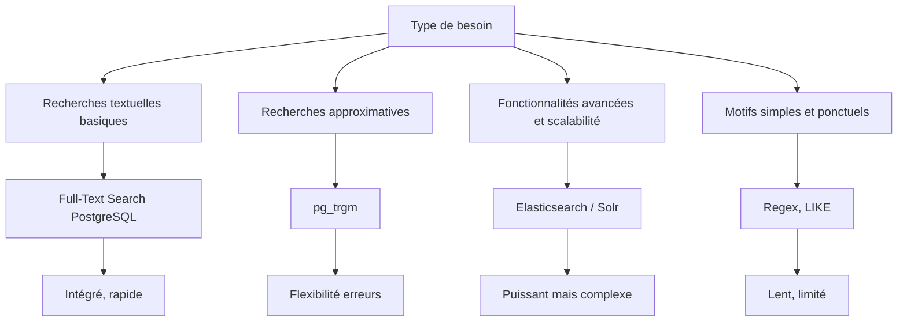

# 6-Recherche Full-Text & alternatives  
## 2-Alternatives et bonnes pratiques  
### 2-Limites et alternatives au Full-Text Search classique

---

Le **Full-Text Search (FTS)** intégré à PostgreSQL est puissant et performant pour de nombreuses recherches textuelles, mais il présente certaines limites selon les cas d’usage, notamment en termes de flexibilité, pertinence et gestion de données très volumineuses. Cet article expose ces limites et propose des alternatives adaptées.

---

## 1. Limites du Full-Text Search classique dans PostgreSQL

### 1.1 Gestion linguistique limitée

- Stemming et stopwords sont dépendants des configurations linguistiques préétablies (ex. `french`, `english`).
- Difficultés avec les mots composés, synonymes, conjugaisons complexes, et langues non prises en charge nativement.

### 1.2 Absence de recherche approximative (fuzzy search)

- Le FTS ne gère pas les fautes de frappe ou variantes proches.  
- Pas de mesures de distance de Levenshtein ou autres similarités dans la recherche standard.

### 1.3 Contrôle limité de la pertinence

- `ts_rank` ou `ts_rank_cd` calculent un score de pertinence basique, mais les utilisateurs ne peuvent pas facilement intégrer des pondérations plus complexes ou un apprentissage machine.

### 1.4 Impossibilité de recherche en champ libre pour certains cas

- Le FTS nécessite la transformation préalable en `tsvector`, peut être contraignant pour les colonnes non optimisées.
- Requêtes sur contenus binaires ou formats non textuels ne sont pas gérées directement.

---

## 2. Alternatives pour compléter ou remplacer le Full-Text Search

### 2.1 Extension pg_trgm pour recherche floue

- Recherche approximative via trigrammes, avec index GIN/GiST.
- Très utile sur les colonnes texte pour les recherches avec erreurs typographiques ou approchées.

```sql
CREATE EXTENSION pg_trgm;
CREATE INDEX ON documents USING GIN (contenu gin_trgm_ops);

SELECT * FROM documents WHERE contenu % 'Postgres';
```

---

### 2.2 Utilisation d’index externes : Elasticsearch, Solr

- Solutions dédiées spécialisées dans la recherche full-text avancée, index distribués, et analysent sémantique approfondie.
- Supportent des fonctionnalités avancées : synonymes, facets, typo tolerance, scoring sophistiqué, clustering.
- Apache Lucene comme base technologique.

---

### 2.3 Recherche via des expressions régulières et LIKE

- Plus flexible mais lent et non indexé (sauf avec trigrammes activés).
- Adapté pour des motifs simples et non volumineux.

---

### 2.4 Recherche textuelle avec solutions noSQL dédiées

- Bases de données orientées document (ex : MongoDB Atlas Search) intégrant un moteur full-text optimisé.
- Utiles dans des architectures hybrides.

---

## 3. Conseils pour choisir la bonne approche

| Critère                 | Full-Text Search PostgreSQL | pg_trgm              | Elasticsearch / Solr         | Expressions régulières    |
|-------------------------|-----------------------------|----------------------|-----------------------------|--------------------------|
| Volume de données       | Moyen à grand               | Moyen                | Très grand                  | Petit à moyen            |
| Tolérance aux fautes     | Faible                      | Élevée               | Élevée                      | Faible                   |
| Fonctionnalités sémantiques | Basique                | Non                  | Très riche                  | Non                      |
| Facilité d’intégration   | Intégré PostgreSQL           | Extension PostgreSQL | Solution tierce, plus complexe | Intégré PostgreSQL       |

---

## 4. Diagramme Mermaid – Comparaison des approches



---

## 5. Exemple pratique d’usage alternatif

Requête de recherche approximative sur un produit dans une base PostgreSQL avec pg_trgm :

```sql
CREATE EXTENSION IF NOT EXISTS pg_trgm;

CREATE TABLE produits (
  id SERIAL PRIMARY KEY,
  nom TEXT
);

CREATE INDEX idx_nom_trgm ON produits USING GIN (nom gin_trgm_ops);

INSERT INTO produits (nom) VALUES ('PostgreSQL'), ('Postgres'), ('PostgreSQL Guide');

SELECT * FROM produits WHERE nom % 'Postgresqll';
```

---

## 6. Sources utilisées

- PostgreSQL Documentation, [Limitations of Full-Text Search](https://www.postgresql.org/docs/current/textsearch-limitations.html)  
- PostgreSQL Documentation, [pg_trgm module](https://www.postgresql.org/docs/current/pgtrgm.html)  
- Elastic, [Why Elasticsearch?](https://www.elastic.co/what-is/elasticsearch)  
- Severalnines, [Full Text Search Alternatives](https://severalnines.com/database-blog/tutorial-postgresql-text-search-alternatives)  

---

La connaissance des limites du Full-Text Search classique conduit à exploiter les outils complémentaires adaptés aux besoins spécifiques, qu’ils soient intégrés (extensions PostgreSQL) ou externes (Elasticsearch), pour fournir une recherche textuelle performante et pertinente dans tous les contextes.